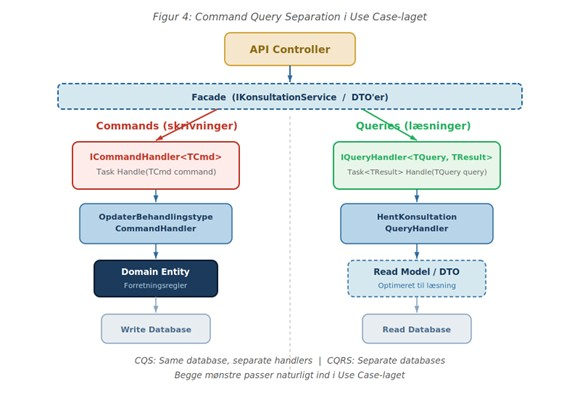
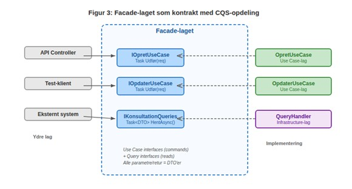
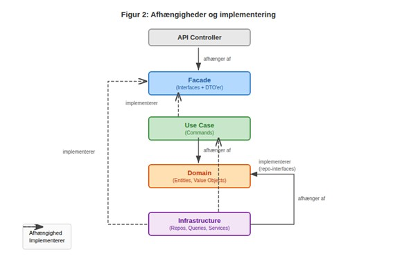

# **Clean Architecture**

med Onion-principper, DDD, Facade-lag og CQS

En praktisk guide til lagdelt arkitektur i moderne .NET-applikationer

Februar 2026

# Indholdsfortegnelse

[1 Indholdsfortegnelse [1](#_Toc221365797)](#_Toc221365797)

[2 Indledning [3](#indledning)](#indledning)

[3 Baggrund og motivation [3](#baggrund-og-motivation)](#baggrund-og-motivation)

[3.1 Problemet med klassisk lagdelt arkitektur [3](#problemet-med-klassisk-lagdelt-arkitektur)](#problemet-med-klassisk-lagdelt-arkitektur)

[3.2 Onion Architecture [3](#onion-architecture)](#onion-architecture)

[3.3 Clean Architecture [3](#clean-architecture)](#clean-architecture)

[3.4 Domain-Driven Design (DDD) [3](#domain-driven-design-ddd)](#domain-driven-design-ddd)

[4 Arkitekturoversigt [4](#_Toc221365804)](#_Toc221365804)

[4.1 Command Query Separation (CQS) [6](#command-query-separation-cqs)](#command-query-separation-cqs)

[4.1.1 Princippet [6](#princippet)](#princippet)

[4.1.2 CQS i Use Case-laget [6](#cqs-i-use-case-laget)](#cqs-i-use-case-laget)

[4.1.3 CQS vs. CQRS – hvornår eskalere? [7](#cqs-vs.-cqrs-hvornår-eskalere)](#cqs-vs.-cqrs-hvornår-eskalere)

[5 Domain-laget [8](#domain-laget)](#domain-laget)

[5.1 Entity-klasser med DDD [8](#entity-klasser-med-ddd)](#entity-klasser-med-ddd)

[5.2 Value Objects [9](#value-objects)](#value-objects)

[5.3 Domain Services [9](#domain-services)](#domain-services)

[6 Use Case-laget [10](#use-case-laget)](#use-case-laget)

[6.1 Strukturen af et Use Case [10](#strukturen-af-et-use-case)](#strukturen-af-et-use-case)

[6.2 Repository-interfaces [11](#repository-interfaces)](#repository-interfaces)

[7 Facade-laget [11](#facade-laget)](#facade-laget)

[7.1 Formålet med Facade-laget [12](#formålet-med-facade-laget)](#formålet-med-facade-laget)

[7.2 Interfaces i Facade-laget [12](#interfaces-i-facade-laget)](#interfaces-i-facade-laget)

[7.3 DTO’er (Data Transfer Objects) [13](#dtoer-data-transfer-objects)](#dtoer-data-transfer-objects)

[8 Infrastructure-laget [15](#infrastructure-laget)](#infrastructure-laget)

[8.1 Repository-implementering [15](#repository-implementering)](#repository-implementering)

[8.2 Query-handler implementering (CQS) [16](#query-handler-implementering-cqs)](#query-handler-implementering-cqs)

[8.3 Eksterne systemer [17](#eksterne-systemer)](#eksterne-systemer)

[9 Afhængighedsregler og projektstruktur [18](#afhængighedsregler-og-projektstruktur)](#afhængighedsregler-og-projektstruktur)

[9.1 Dependency Rule [18](#dependency-rule)](#dependency-rule)

[9.2 Projektstruktur i .NET [19](#projektstruktur-i-.net)](#projektstruktur-i-.net)

[10 Testbarhed [21](#testbarhed)](#testbarhed)

[10.1 Domain-tests [21](#domain-tests)](#domain-tests)

[10.2 Use Case-tests med Moq [21](#use-case-tests-med-moq)](#use-case-tests-med-moq)

[10.3 Query-handler-tests med Moq [22](#query-handler-tests-med-moq)](#query-handler-tests-med-moq)

[11 Fordele og overvejelser [23](#fordele-og-overvejelser)](#fordele-og-overvejelser)

[11.1 Fordele [23](#fordele)](#fordele)

[11.2 Overvejelser [23](#overvejelser)](#overvejelser)

[12 Konklusion [24](#konklusion)](#konklusion)

[13 Kilder [24](#kilder)](#kilder)

# Indledning

Softwarearkitektur handler i bund og grund om at organisere kode, så den er nem at forstå, teste og vedligeholde over tid. I takt med at systemer vokser, bliver det afgørende at holde forretningslogikken adskilt fra tekniske detaljer som databaser, brugergrænseflader og eksterne integrationer.

Denne artikel præsenterer en arkitekturmodel, der kombinerer de bedste idéer fra Clean Architecture (Robert C. Martin) \[1\], Onion Architecture (Jeffrey Palermo) \[2\], Domain-Driven Design (Eric Evans) \[3\] og Command Query Separation (Bertrand Meyer). Resultatet er en fire-lags struktur, der placerer forretningsdomænet i centrum, bruger et eksplicit Facade-lag til at definere kontrakten mellem kernen og omverdenen, og strukturerer Use Cases som enten Commands eller Queries.

Artiklen er skrevet med .NET og C# som reference, men principperne kan overføres til enhver moderne platform.

# Baggrund og motivation

## Problemet med klassisk lagdelt arkitektur

I en traditionel tre-lags arkitektur (Presentation – Business Logic – Data Access) peger afhængighederne typisk nedad: præsentationslaget kalder forretningslaget, som kalder datalaget. Det betyder, at forretningslogikken er tæt koblet til dataadgangsteknologien. Hvis man vil skifte fra SQL Server til PostgreSQL eller fra Entity Framework til Dapper, skal forretningslaget ændres.

## Onion Architecture

Onion Architecture \[2\] vender afhængighederne om. Kernen (domænet) har ingen referencer udad. I stedet definerer kernen interfaces, som de ydre lag implementerer. Det giver en arkitektur, der ligner en løg med koncentriske ringe, hvor den inderste ring er den mest stabile og den yderste ring den mest foranderlige.

## Clean Architecture

Robert C. Martins Clean Architecture \[1\] bygger på samme princip, men tilføjer et eksplicit Use Case-lag, der repræsenterer applikationens handlinger. Dependency Rule siger, at kildekode-afhængigheder kun må pege indad mod de indre lag. Et ydre lag kan kende til et indre lag, men aldrig omvendt.

## Domain-Driven Design (DDD)

DDD tilbyder et rigt sæt af mønstre til modellering af forretningsdomænet. I denne arkitektur bruger vi især Entity-mønstret, hvor alle egenskaber har private setters, og tilstand kun kan ændres gennem eksplicitte metoder på entity-klassen. Det sikrer, at forretningsreglerne altid overholdes, og at objekter aldrig befinder sig i en ugyldig tilstand.

# Arkitekturoversigt

Figur 1 viser den overordnede lagmodel. I modsætning til en traditionel koncentrisk model er diagrammet opdelt i to halvdele: den øverste halvdel er Facade-laget, som udgør den eneste indgang til kernen. Al kommunikation fra eksterne konsumenter (API-controllere, test-klienter, eksterne systemer) passerer gennem Facade-lagets interfaces og DTO’er. Den nederste halvdel er Infrastructure-laget, der implementerer de interfaces, som kernen definerer – herunder repositories, database-kontekst, eksterne API-klienter og, med CQS/CQRS, også query-handlers, der kan gå direkte til databasen uden at involvere domæne-entities.

I centrum ligger kernen: Use Case-laget (som orkestrerer Commands og Queries) og Domain-laget (som indeholder forretningsregler i DDD-entities og Domain Services). Kernen har ingen afhængigheder udad – den definerer interfaces, som de ydre lag implementerer.

Modellen består af fire lag:

|  |  |  |
|----|----|----|
| **Lag** | **Ansvar** | **Indhold** |
| Domain | Kerneforretningslogik | Entity-klasser (DDD), Domain Services, Value Objects |
| Use Case | Applikationslogik | Use Case-klasser, Interfaces for Infrastructure-funktionalitet |
| Facade | Kontraktlag / API-overflade | Use Case-interfaces, Query-interfaces, DTO’er |
| Infrastructure | Teknisk implementering | Database-adgang, eksterne API’er, messaging |

Det centrale princip er Dependency Rule: afhængigheder peger altid indad mod kernen. Domain-laget kender intet til de andre lag. Use Case-laget afhænger kun af Domain, men implementerer Facade-lagets interfaces. Facade-laget (toppen) definerer kontrakten (interfaces og DTO’er) og kender ikke til andre lag. Infrastructure-laget (bunden) implementerer de interfaces, som er defineret i Facade og Use Case – herunder query-handlers, der med CQS/CQRS kan gå direkte til databasen for læseoperationer. Infrastructure-laget afhænger også af Domain, idet materialisering og persistering af domæne-objekter sker i Infrastructure-laget.

## Command Query Separation (CQS)

Command Query Separation er et princip introduceret af Bertrand Meyer \[4\], der siger, at enhver metode enten skal være en command, der ændrer tilstand, eller en query, der returnerer data – aldrig begge dele. Når dette princip anvendes på Use Case-niveau, får man en naturlig opdeling af applikationslogikken, der gør systemet lettere at forstå, teste og optimere.

### Princippet

CQS adskiller sig fra CQRS (Command Query Responsibility Segregation) \[7\] ved sin enkelhed. CQS handler om at strukturere Use Cases i to kategorier: Commands, der ændrer tilstand og ikke returnerer data, og Queries, der returnerer data uden at ændre tilstand. CQRS tager det et skridt videre med separate læse- og skrivemodeller og potentielt separate databaser. I denne arkitektur starter vi med CQS og åbner døren for CQRS, hvis behovet opstår.

### CQS i Use Case-laget

Ved at opdele Use Cases i Commands og Queries får hvert Use Case et klart ansvar. Commands passerer altid gennem Domain-laget, hvor forretningsreglerne håndhæves. Queries kan derimod gå direkte til infrastructure og returnere DTO’er uden at involvere domæne-entities. Det giver mulighed for at optimere læsninger uafhængigt af skrivemodellen.



### CQS vs. CQRS – hvornår eskalere?

CQS med fælles database er tilstrækkeligt for de fleste systemer. Overvej at eskalere til fuld CQRS med separate læse- og skrivedatabaser, når der er markant forskellige skaleringskrav for læsninger og skrivninger, når read-modellen skal denormaliseres kraftigt for performance, eller når systemet kræver event sourcing. Pointen er, at CQS-strukturen i Use Case-laget forbereder jer på CQRS uden at kræve det fra start.

# Domain-laget

Domain-laget er arkitekturens hjerte. Det indeholder forretningslogikken i sin reneste form og har ingen afhængigheder til andre lag eller frameworks. Alt i dette lag skal kunne kompilere og testes uden en database, et web-framework eller noget som helst eksternt.

## Entity-klasser med DDD

**Entity-klasser modellerer de centrale forretningsobjekter**. Inspireret af DDD \[3\] har alle egenskaber private setters, og tilstandsændringer sker udelukkende via metoder, der håndhæver forretningsregler. Konstruktoren sikrer, at objektet altid oprettes i en gyldig tilstand.

```c#
public class Konsultation //Entity

{
    public Guid Id { get; private set; }
    public Tidsinterval Tidspunkt { get; private set; } //Value Object
    public Behandlingstype Behandlingstype { get; private set; } //Entity
    public string Notat { get; private set; } = string.Empty;
    public KonsultationStatus Status { get; private set; } //Enum

    // Privat parameterløs konstruktor til ORM
    private Konsultation()
    {
    }

    public Konsultation(Tidsinterval tidspunkt, Behandlingstype type)
    {
        if (tidspunkt.Fra < DateTime.UtcNow)
            throw new DomainException("Konsultation kan ikke oprettes i fortiden.");

        Id = Guid.NewGuid();
        Tidspunkt = tidspunkt;
        Behandlingstype = type;
        Status = KonsultationStatus.Planlagt;
    }

    public void OpdaterBehandlingstype(Behandlingstype nyType)
    {
        if (Status == KonsultationStatus.Afsluttet)
            throw new DomainException("Kan ikke ændre type på afsluttet konsultation.");

        Behandlingstype = nyType;
    }

    public void Afslut(string notat)
    {
        if (string.IsNullOrWhiteSpace(notat))
            throw new DomainException("Afslutning kræver et notat.");

        Notat = notat;
        Status = KonsultationStatus.Afsluttet;
    }
}
```

Bemærk, at der ikke er en eneste public setter. Enhver ændring af tilstand sker gennem metoder, som validerer forretningsreglerne. Det er essensen af DDD-tilgangen til entities: objektet beskytter sin egen konsistens.

## Value Objects

**Value Objects repræsenterer begreber uden egen identitet,** for eksempel en adresse, et beløb eller et tidsinterval. De er immutable og sammenlignes på værdi i stedet for reference.

```c#
public record Tidsinterval(DateTime Fra, DateTime Til)
{
    public Tidsinterval(DateTime fra, DateTime til) : this(fra, til)
    {
        if (til <= fra)
            throw new DomainException(
            "Til-dato skal være efter fra-dato.");
    }
    public TimeSpan Varighed => Til - Fra;
}
```


## Domain Services

**Når en forretningsregel involverer flere entities** eller ikke naturligt hører til på en enkelt entity, placeres den i en Domain Service. En Domain Service er en stateless klasse, der opererer udelukkende på domæneobjekter.

```c#
public class KonsultationOverlapService : IKonsultationOverlapService
{
    public bool HarOverlap(Konsultation ny, IEnumerable<Konsultation> eksisterende)
    {
        return eksisterende.Any(k => 
                                k.Id != ny.Id &&
                                k.Status != KonsultationStatus.Aflyst &&
                                ny.Tidspunkt.Fra < k.Tidspunkt.Til &&
                                k.Tidspunkt.Fra < ny.Tidspunkt.Til);
    }
}
```


# Use Case-laget

**Use Case-laget orkestrerer applikationslogikken**. Hvert use case repræsenterer en konkret handling, som systemet kan udføre, for eksempel "Opdater behandlingstype for en konsultation" eller "Opret ny patient". Use Cases kalder Domain-laget for forretningsregler og definerer interfaces (porte) til det, der skal implementeres af Infrastructure.

## Strukturen af et Use Case

Et Use Case følger et simpelt mønster: det modtager en DTO som input, henter (materialiserer) de nødvendige domæneobjekter, udfører forretningslogikken og persisterer resultatet. Use Cases returnerer altid Task (void) – de ændrer tilstand, men returnerer ikke data. Læsning af data sker via separate Query-interfaces (se Facade-laget og Infrastructure-laget). Til datadgang bruges repository-interfaces, som ligger i Use Case-laget.

```c#
public class OpdaterBehandlingstypeUseCase : IOpdaterBehandlingstypeUseCase
{
    private readonly IBehandlingstypeRepository \_behandlingstypeRepo;
    private readonly IKonsultationRepository \_repo;

    public OpdaterBehandlingstypeUseCase(IKonsultationRepository repo, 
                                         IBehandlingstypeRepository behandlingstypeRepo)
    {
        _repo = repo;
        _behandlingstypeRepo = behandlingstypeRepo;
    }

    public async Task Udfør(OpdaterBehandlingstypeRequest request)
    {
        // Materialiser domain-objekter
        var konsultation = await _repo.HentAsync(request.KonsultationId);

        if (konsultation is null)
            throw new NotFoundException("Konsultation ikke fundet.");

        var nyBehandlingstype = await _behandlingstypeRepo.HentAsync(request.BehandlingstypeId);
        if (nyBehandlingstype is null)
            throw new NotFoundException("Behandlingstype ikke fundet.");

        // Udfør forretningslogik
        konsultation.OpdaterBehandlingstype(nyBehandlingstype);

        // Persistér ændringer
        await _repo.GemAsync();
    }

}
```

Use Case-klassen har ét ansvar og én public metode, der modtager en DTO og returnerer Task. Det gør den nem at teste, forstå og vedligeholde. Bemærk, at Use Casen kalder domæne-metoden OpdaterBehandlingstype, som håndhæver forretningsreglerne. Use Casen indeholder altså ikke selv valideringslogik, men delegerer den til domænet. Kun hvis der er Use Case-specifikke forretningsregler, implementeres valideringen af disse i Use Casen.

## Repository-interfaces

Repository-interfaces \[5\] definerer kontrakten for datadgang til materialisering og persistering af domæne-objekter uden at specificere teknologien. De placeres i Use Case-laget.

```c#
public interface IKonsultationRepository
{
    Task<Konsultation?> HentAsync(Guid id);
    Task<IReadOnlyList<Konsultation>> HentAlleAsync();
    Task GemAsync();
}
```


# Facade-laget

Facade-laget er det, der gør denne arkitektur unik i forhold til standard Clean Architecture. Som illustreret i Figur 1 udgør Facade-laget den øverste halvdel af modellen og er den eneste indgang til kernen. I dette lag findes udelukkende interfaces og DTO’er – ingen implementering. Interfaces opdeles efter CQS-princippet: ét interface per Use Case (command) og ét interface per Query-gruppe. Alle metodeparametre og returværdier er DTO’er – domæne-entities eksponeres aldrig.

## Formålet med Facade-laget

Facade-laget løser et praktisk problem: når API-controllere, test-klienter eller eksterne systemer skal kommunikere med applikationen, har de brug for en veldefineret kontrakt. Ved at placere Facade som den eksklusive indgang sikrer man, at ingen konsument nogensinde taler direkte med Use Cases eller domæne-entities. Interfacene er opdelt, så hvert Use Case-interface har præcis én metode (Task/void), og query-interfaces grupperer relaterede læseoperationer. Figur 3 illustrerer denne adskillelse: ydre lag kommunikerer udelukkende via Facade-lagets interfaces, og de konkrete implementeringer (Use Case-klasser og query-handlers) implementerer disse interfaces fra henholdsvis Use Case-laget og Infrastructure-laget.




Uden et Facade-lag ender man ofte med, at UI-kode refererer direkte til Use Case-klasser og domæne-entities, hvilket skaber unødvendige afhængigheder.

Med Facade-laget får man en klar adskillelse. Ydre lag kommunikerer kun med kernen via Facade-lagets interfaces og DTO’er. Det betyder, at man kan ændre den interne struktur af Domain og Use Case uden at påvirke nogen konsumenter.

## Interfaces i Facade-laget

Interfaces opdeles efter CQS-princippet i to kategorier. Use Case-interfaces repræsenterer commands (skrivninger) og har præcis én metode, der returnerer Task (void). Alle parametre er DTO’er. Query-interfaces grupperer relaterede læseoperationer og returnerer DTO’er.

```c#
// === USE CASE INTERFACES (commands) ===
// Ét interface per Use Case, returnerer Task (void)
public interface IOpdaterBehandlingstypeUseCase
{
    Task Udfør(OpdaterBehandlingstypeRequest request);
}

public interface IOpretKonsultationUseCase

{
    Task Udfør(OpretKonsultationRequest request);
}

public interface IAfslutKonsultationUseCase
{
    Task Udfør(AfslutKonsultationRequest request);
}

// === QUERY INTERFACES (læsninger) ===
// Grupperer relaterede queries, returnerer DTO'er
public interface IKonsultationQueries
{
    Task<KonsultationDto?> HentAsync(HentKonsultationRequest request);
    Task<IReadOnlyList<KonsultationDto>> SøgAsync(SøgKonsultationerRequest request);
}
```

Bemærk den klare adskillelse: Use Case-interfaces har aldrig en returværdi (Task, ikke Task\<T\>), og alle parametre er DTO’er. Domæne-typer som Behandlingstype eller Guid optræder ikke direkte i signaturen – de er indkapslet i request-DTO’erne. Query-interfaces returnerer altid DTO’er og modtager request-DTO’er som parametre. Denne konsistens gør kontrakten forudsigelig og let at arbejde med.

## DTO’er (Data Transfer Objects)

DTO’er er simple dataklasser, der bærer data mellem lagene. De indeholder ingen forretningslogik og har udelukkende public getters. Alle parametre til Facade-interfaces og alle returværdier er DTO’er – domæne-entities eksponeres aldrig ud over Facade-grænsen.

```c#
// Request DTO'er til Use Cases (commands)
public record OpretKonsultationRequest(DateTime Tidspunkt, Guid BehandlingstypeId);

public record OpdaterBehandlingstypeRequest(Guid KonsultationId, Guid BehandlingstypeId);

public record AfslutKonsultationRequest(Guid KonsultationId, string Notat);

// Response DTO'er
public record KonsultationDto(
    Guid Id,
    DateTime Tidspunkt,
    DateTime Til,
    Guid BehandlingstypeId,
    string Status,
    string? Notat);

// Request DTO'er til Queries
public record HentKonsultationRequest(Guid KonsultationId);

public record SøgKonsultationerRequest(DateTime? FraDato, DateTime? TilDato, string? StatusFilter);
```

Ved at bruge C# records får man immutable DTO’er med minimal kode. Bemærk, at request-DTO’erne bruger primitive typer (string, Guid, DateTime) i stedet for domæne-typer (Behandlingstype). Det sikrer, at Facade-laget er helt uafhængigt af Domain-lagets interne typer. Mapping fra DTO til domæne-type sker i Use Case-laget og Infrastructure-laget.

# Infrastructure-laget

Infrastructure-laget udgør den nederste halvdel af lagmodellen (se Figur 1) og indeholder al teknisk implementering: databaseadgang, eksterne API-kald, messaging, caching og lignende. Det er det eneste lag, der har afhængigheder til tredjepartsbiblioteker som Entity Framework, HttpClient eller message brokers. Med CQS/CQRS placeres query-handlers også her, da de kan gå direkte til databasen med optimerede forespørgsler uden at involvere domæne-entities.

## Repository-implementering

Repositories anvendes af Use Cases til at materialisere og persistere domæne-objekter, dvs. til at læse og skrive domæne-objekter til databasen.

Repositories anvendes IKKE til Queries – disse håndteres særskilt – forklaring følger senere.

```c#
public class KonsultationRepository : IKonsultationRepository
{
    private readonly AppDbContext _db;
    public KonsultationRepository(AppDbContext db)
    {
        _db = db;
    }

    public async Task\<Konsultation?\> HentAsync(Guid id)
    {
        return await _db.Konsultationer.FindAsync(id);
    }

    public async Task<IReadOnlyList<Konsultation>> HentAlleAsync()
    {
        return await _db.Konsultationer.ToListAsync();
    }

    **public async Task GemAsync()**
        **{**
            **await \_db.SaveChangesAsync();**
          }
}
```

Bemærk GemAsync metoden. **Her kaldes \_db.Konsultationer.Update(konsultation); Ikke**. Årsagen er, at Entity Framework tracker ændringerne i domæne-objekterne, idet disse er indlæst af Use Casen, inden der foretages ændringer. **Update skal kun anvendes hvis objekter ikke allerede er under tracking.**

**Eksempel på hvordan koden IKKE skal se ud**

```c#
public async Task GemAsync(Konsultation konsultation)
{
    **\_db.Konsultationer.Update(konsultation); // Antipattern**
    await \_db.SaveChangesAsync();
}
```


## Query-handler implementering (CQS)

Med CQS/CQRS hører implementeringen af query-handlers naturligt til i Infrastructure-laget. Query-handleren kan bruge optimerede SQL-forespørgsler, database views, Dapper eller Entity Framework i non-tracking-tilstand til at returnere DTO’er direkte – uden at loade domæne-entities gennem en ORM. Det giver markant bedre performance for læsetunge operationer.

Derfor implementerer Infrastructure-laget Facade-lagets Query-interfaces direkte og ikke via Use Case-laget.

```c#
// Infrastructure: Read med Entity Framework
public class KonsultationQueriesImpl : IKonsultationQueries
{
    private readonly AppDbContext _db;

    public KonsultationQueriesImpl(AppDbContext db)
    {
        _db = db;
    }

    public async Task<KonsultationDto?> HentAsync(HentKonsultationRequest request)
    {
        return await _db.Konsultationer.AsNoTracking()
            .Include(a => a.Behandlingstype)
            .Select(b => new KonsultationDto(
                b.Id,
                b.Tidspunkt.Fra,
                b.Tidspunkt.Til,
                b.Behandlingstype.Id,
                b.Status.ToString(),
                b.Notat))
            .FirstOrDefaultAsync(a =\> a.Id == request.KonsultationId);
    }
}
```

**Bemærk: AsNoTracking()**

Dette er helt centralt, idet Entity Framework IKKE bruger ressourcer på at tracke objekter, og derved opnår en læsehastighed, der er ækvivalent med Dapper.

## Eksterne systemer

Integrationer til eksterne systemer som e-mail-services, betalingsgateways eller tredjeparts-API’er placeres ligeledes i Infrastructure-laget. De implementerer interfaces defineret i Facade- eller Use Case-laget.

```c#
public interface INotifikationService
{
    Task SendPåmindelseAsync(
        Guid konsultationId);
}

// Infrastructure-implementering:
public class EmailNotifikationService : INotifikationService
{
    private readonly IEmailClient _email;

    public async Task SendPåmindelseAsync(Guid konsultationId)
    {
        // Hent data og send e-mail
    }
}
```


# Afhængighedsregler og projektstruktur

## Dependency Rule

Den vigtigste regel i hele arkitekturen er Dependency Rule: kildekode-afhængigheder må kun pege indad. Figur 2 illustrerer, hvordan afhængighederne og implementeringerne flyder i systemet. API-controlleren afhænger af Facade-laget (interfaces og DTO’er). Use Case-laget implementerer Facade-lagets interfaces, men afhænger ikke af Facade – det er Facade, der definerer kontrakten, som Use Case opfylder. Use Case-laget afhænger af Domain-laget for forretningslogik. Infrastructure-laget implementerer både Facade-lagets query-interfaces og Use Case-lagets repository-interfaces, og afhænger desuden af Domain-laget, idet materialisering og persistering af domæne-objekter sker her.




Tabellen nedenfor viser, hvad hvert lag må og ikke må referere til.

|  |  |  |  |
|----|----|----|----|
| **Lag** | **Må referere til** | **Må IKKE referere til** | **Retning** |
| Domain | Intet (selvstændigt) | Use Case, Facade, Infra | Inderst |
| Use Case | Domain (implementerer Facade) | Infrastructure | Indad |
| Facade | Intet (kun interfaces og DTO’er) | Domain, Use Case, Infra | Kontrakt |
| Infrastructure | Facade, Use Case, Domain | – | Yderst |

## Projektstruktur i .NET

I en typisk .NET Solution ville strukturen se sådan ud:

> MinLøsning/
>
> ├── src/
>
> │ ├── MinApp.Domain/ \# Entities, Value Objects, Domain Services
>
> │ ├── MinApp.UseCases/ \# Use Case-klasser, port-interfaces
>
> │ ├── MinApp.Facade/ \# Interfaces + DTO’er
>
> │ ├── MinApp.Infrastructure/ \# EF Core, repos, service-impl.
>
> │ └── MinApp.Api/ \# ASP.NET controllere
>
> ├── tests/
>
> │ ├── MinApp.Domain.Tests/
>
> │ ├── MinApp.UseCases.Tests/
>
> │ └── MinApp.Integration.Tests/
>
> └── MinLøsning.sln

API-controllerne refererer kun til Facade-laget (Use Case-interfaces og Query-interfaces) og bruger dependency injection til at resolve de konkrete implementeringer fra Infrastructure.

```c#
[ApiController]
[Route("api/konsultationer")]
public class KonsultationController : ControllerBase
{
    private readonly IOpdaterBehandlingstypeUseCase _opdaterUC;
    private readonly IAfslutKonsultationUseCase _afslutUC;
    private readonly IKonsultationQueries _queries;

    public KonsultationController(IOpdaterBehandlingstypeUseCase opdaterUC,
                                  IAfslutKonsultationUseCase afslutUC,
                                  IKonsultationQueries queries)
    {
        _opdaterUC = opdaterUC;
        _afslutUC = afslutUC;
        _queries = queries;
    }

    [HttpPut("{id}/behandlingstype")]
    public async Task<IActionResult> OpdaterBehandlingstype(Guid id, OpdaterBehandlingstypeDto body)
    {
        await _opdaterUC.Udfør(new OpdaterBehandlingstypeRequest(id, body.NyType));
        return NoContent();
    }

    [HttpGet("{id}")]
    public async Task<IActionResult> Hent(Guid id)
    {
        var dto = await _queries.HentAsync(new HentKonsultationRequest(id));
        return dto is null ? NotFound() : Ok(dto);
    }
}
```


# Testbarhed

En af de største fordele ved denne arkitektur er testbarheden. Fordi afhængigheder peger indad og er defineret via interfaces, kan hvert lag testes isoleret. Til mocking af interfaces anvendes Moq-frameworket \[8\], som gør det nemt at oprette testdoubles uden at skrive manuelle in-memory implementeringer.

## Domain-tests

Domain-laget kan testes uden mocks, da det ingen afhængigheder har. Man tester direkte på entity-metoderne og verificerer, at forretningsreglerne håndhæves korrekt.

```c#
[Fact]
public void OpdaterBehandlingstype_PaaAfsluttet_Fejler()
{
    var konsultation = new Konsultation(new Tidsinterval(
        DateTime.UtcNow.AddDays(1), DateTime.UtcNow.AddDays(1).AddHours(1)), behandlingstype);

    konsultation.Afslut("Test-notat");

    Assert.Throws<DomainException>(() =>
                                   konsultation.OpdaterBehandlingstype(nyBehandlingstype));
}
```


## Use Case-tests med Moq

Use Cases testes ved at mocke repository-interfaces med Moq. Moq gør det muligt at opsætte præcise forventninger til, hvilke metoder der kaldes, og hvad de returnerer – uden at skrive manuelle in-memory implementeringer. Herunder testes, at Use Casen kalder domæne-metoden korrekt og persisterer resultatet.

```c#
[Fact]
public async Task Udfør_OpdatererBehandlingstype()
{
    // Arrange
    var behandlingstype = new Behandlingstype(...);
    var konsultation = new Konsultation(
        new Tidsinterval(
            DateTime.UtcNow.AddDays(1),
            DateTime.UtcNow.AddDays(1).AddHours(1)),
        behandlingstype);
    var nyBehandlingstype = new Behandlingstype(...);
    var mockRepo = new Mock<IKonsultationRepository>();
    mockRepo.Setup(r => r.HentAsync(konsultation.Id)).ReturnsAsync(konsultation);
    var mockBehandRepo = new Mock<IBehandlingstypeRepository>();
    mockBehandRepo.Setup(r => r.HentAsync(nyBehandlingstype.Id)).ReturnsAsync(nyBehandlingstype);

    var useCase = new OpdaterBehandlingstypeUseCase(mockRepo.Object, mockBehandRepo.Object);

    // Act
    await useCase.Udfør(new OpdaterBehandlingstypeRequest(konsultation.Id, nyBehandlingstype.Id));

    // Assert
    Assert.Equal(nyBehandlingstype, konsultation.Behandlingstype);
    mockRepo.Verify(r => r.GemAsync(), Times.Once);
}
```

Bemærk brugen af Moq’s Setup til at konfigurere, hvad repositories returnerer, og Verify til at sikre, at GemAsync blev kaldt præcis én gang. Mock\<T\>.Object leverer den mockede instans til Use Casen.

## Query-handler-tests med Moq

Query-handlers i Infrastructure-laget kan testes ved at mocke AppDbContext eller ved at anvende en in-memory database. For unit tests med Moq kan man abstrahere dataaccesset bag et interface. Herunder vises et eksempel, hvor IKonsultationQueries-interfacet testes direkte med Moq for at verificere, at den rette DTO returneres.

```c#
[Fact]
public async Task HentAsync_ReturnererKorrektDto()
{
    // Arrange
    var konsultationId = Guid.NewGuid();
    var forventetDto = new KonsultationDto(
        konsultationId, DateTime.UtcNow,
        DateTime.UtcNow.AddHours(1),
        Guid.NewGuid(), "Planlagt", null);
    var mockQueries = new Mock<IKonsultationQueries>();

    mockQueries.Setup(q => q.HentAsync(It.Is<HentKonsultationRequest>
                                       (r => r.KonsultationId == konsultationId))).
        ReturnsAsync(forventetDto);

    // Act
    var resultat = await mockQueries.Object.HentAsync(
        new HentKonsultationRequest(konsultationId));

    // Assert
    Assert.NotNull(resultat);
    Assert.Equal(konsultationId, resultat.Id);
    Assert.Equal("Planlagt", resultat.Status);
}
```


# Fordele og overvejelser

## Fordele

- **Uafhængighed af frameworks:** Domænet kan overleve et komplet skifte af web-framework eller ORM.

- **Testbarhed:** Domain og Use Case kan testes isoleret uden infrastruktur.

- **Klar kontrakt:** Facade-laget giver en eksplicit API-overflade, som eksterne konsumenter kan stole på.

- **DDD-sikkerhed:** Private setters og metoder på entities sikrer, at forretningsregler altid overholdes.

- **Skalerbarhed:** Lag kan deployeres og skaleres uafhængigt i en microservices-kontekst.

- **CQS-klarhed:** Eksplicit adskillelse af læse- og skriveoperationer gør systemet lettere at optimere og forstå.

## Overvejelser

- **Kompleksitet:** For simple CRUD-applikationer kan fire lag føles overdrevet. Vurder om domænet retfærdiggør investeringen.

- **Mapping-overhead:** DTO-mapping mellem lag kræver ekstra kode. Overvej biblioteker som AutoMapper eller Mapperly.

- **Læringsomkostning:** Teamet skal forstå DDD-principperne og lagdelingens regler. Investér i onboarding og dokumentation.

- **Handler-spredning:** CQS kan føre til mange små handler-klasser. Brug en fornuftig mappestruktur og overvej MediatR eller lignende for dispatch.

# Konklusion

Ved at kombinere Clean Architecture’s lagdeling med Onion Architecture’s afhængighedsregel, DDD’s entity-mønstre og Command Query Separation får man en arkitektur, der er robust, testbar og fleksibel. Det tilføjede Facade-lag giver en ren kontrakt, der afskærmer kernen fra omverdenen, og CQS giver en naturlig opdeling af Use Cases i skrive- og læseoperationer.

De fire lag – Domain, Use Case, Facade og Infrastructure – repræsenterer en balance mellem struktur og pragmatisme. Domænet er beskyttet, Use Cases er eksplicitte og opdelt i Commands og Queries, kontrakten er tydelig, og infrastrukturen er udskiftelig.

Start med at identificere de centrale entities og forretningsregler i jeres domæne. Byg dem med private setters og eksplicitte metoder. Strukturér Use Cases som Commands og Queries. Definér kontrakten i et Facade-lag. Og implementér den tekniske infrastruktur til sidst – som det, det altid burde være: en detalje.

# Kilder

\[1\] Martin, Robert C. Clean Architecture: A Craftsman’s Guide to Software Structure and Design. Prentice Hall, 2017.

\[2\] Palermo, Jeffrey. “The Onion Architecture.” jeffreypalermo.com, 2008.

\[3\] Evans, Eric. Domain-Driven Design: Tackling Complexity in the Heart of Software. Addison-Wesley, 2003.

\[4\] Meyer, Bertrand. Object-Oriented Software Construction. 2nd ed. Prentice Hall, 1997.

\[5\] Fowler, Martin. Patterns of Enterprise Application Architecture. Addison-Wesley, 2002.

\[6\] Microsoft. “Entity Framework Core – Change Tracking.” learn.microsoft.com, 2024.

\[7\] Young, Greg. “CQRS Documents.” cqrs.files.wordpress.com, 2010.

\[8\] Moq. “Moq – The most popular mocking framework for .NET.” github.com/devlooped/moq, 2024.
