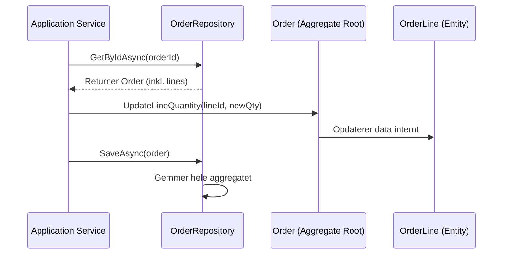
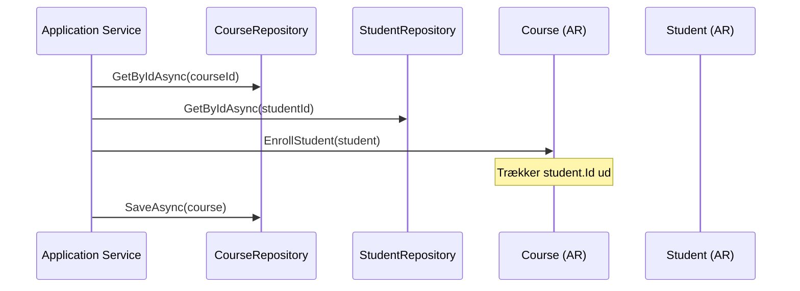

# Domain-Driven Design (DDD): Entity vs. Aggregate Root

I Domain-Driven Design (DDD) er det afgørende at vide, hvordan man grupperer sin forretningslogik. Her er den samlede guide til at forstå, modellere og implementere disse byggeklodser.

## 1. Definitioner og fundamentale forskelle

Kort fortalt: **Alle Aggregate Roots er Entities, men ikke alle Entities er Aggregate Roots**.

### Entity (Entiteten)

En Entity er et objekt, hvor **identiteten** er vigtigere end de data, den indeholder.

- **Identitet:** To objekter er forskellige, selvom de har samme data, fordi de har hver deres unikke ID (f.eks. to `OrderLine`-objekter).
- **Livscyklus:** En Entity skabes, ændres og slettes over tid og lever ofte kun som en del af en større helhed.

### Aggregate Root (Aggregeringsroden)

En Aggregate Root (AR) er den "øverste" Entity i en logisk klynge af objekter (et Aggregate).

- **Portvagt:** Al adgang til objekter inde i et aggregate *skal* gå gennem roden. Man må aldrig ændre en intern Entity direkte udefra.
- **Konsistens:** Det er AR'ens ansvar at sikre, at forretningsreglerne (invarianter) altid er overholdt for hele gruppen.
- **Global Identitet:** En AR har et ID, som resten af systemet kender til og kan søge på (f.eks. via et Repository).

## 2. Tjekliste: Er det en Aggregate Root eller en Entity?

Brug denne tabel til at vurdere dine domæne-objekter:

| **Spørgsmål**                                                | **Svar: Aggregate Root (AR)**                                | **Svar: Entity**                                             |
| ------------------------------------------------------------ | ------------------------------------------------------------ | ------------------------------------------------------------ |
| **Søgning:** Skal man kunne hente objektet direkte fra databasen via et Repository? | **JA.** F.eks. en `Kunde`.                                   | **NEJ.** F.eks. en `OrdreLinje`.                             |
| **Livscyklus:** Overlever objektet, hvis "forælderen" slettes? | **JA.** En `Studerende` findes stadig, selvom et `Hold` slettes. | **NEJ.** En `OrdreLinje` forsvinder automatisk, hvis ordren slettes. |
| **Reference:** Må andre dele af systemet referere direkte til objektets ID? | **JA.** Andre moduler refererer direkte til en `Vare`s ID.   | **NEJ.** Man refererer til "Sal 4, Sæde 12" – ikke sædet globalt. |
| **Ansvar:** Skal objektet styre regler for andre under-objekter? | **JA.** En `Ordre` sikrer f.eks. at totalbeløbet stemmer.    | **NEJ.** En `OrdreLinje` kender kun egne data.               |

## 3. Modellering og Visualisering

Når du tegner klassediagrammer, skal du være opmærksom på relationerne:

- **AR til Entity (samme aggregate):** Brug **Komposition** (sort rude $\blacklozenge$). De hænger uløseligt sammen.
- **AR til AR:** Brug en simpel pil ($\rightarrow$) eller stiplet pil og referér **kun via ID**. Dette holder modulerne afkoblede.

Kodestykke



```mermaid
classDiagram
    class Order {
        <<Aggregate Root>>
        +Guid Id
        +Guid CustomerId
        -List~OrderLine~ _lines
        +AddProduct(Guid productId, int qty)
    }

    class OrderLine {
        <<Entity>>
        +Guid Id
        +int Quantity
        +decimal Price
    }

    class Course {
        <<Aggregate Root>>
        +Guid Id
        +List~Guid~ EnrolledStudentIds
        +EnrollStudent(Student s)
    }

    class Student {
        <<Aggregate Root>>
        +Guid Id
        +string Name
    }

    %% Scenarie A: En Ordre ejer sine linjer
    Order "1" *-- "many" OrderLine : Composition (Ejer indmaden)

    %% Scenarie B: Kursus og Studerende er uafhængige rødder
    Course ..> Student : Reference via StudentId (Løs kobling)
```

## 4. Repository-reglen

I DDD er det en "hellig" regel, at du **kun laver Repositories til dine Aggregate Roots**.

- **Hvorfor?** Det sikrer konsistens, da man ikke kan omgå roden, og det gør systemet mindre komplekst.

| **Objekt**    | **Type** | **Eget Repository?** | **Hvordan tilgås det?**    |
| ------------- | -------- | -------------------- | -------------------------- |
| **Order**     | AR       | **JA**               | `_orderRepo.GetById(id)`   |
| **OrderLine** | Entity   | **NEJ**              | Via `order.Lines`          |
| **Student**   | AR       | **JA**               | `_studentRepo.GetById(id)` |
| **Course**    | AR       | **JA**               | `_courseRepo.GetById(id)`  |

## 5. Implementering i C# og procesforløb

### Scenarie A: En rod med interne Entities

Her henter vi hele aggregatet (roden og dens indmad) samlet via ét repository.

C#

```c#
public async Task UpdateQuantity(Guid orderId, Guid lineId, int newQty)
{
    // Vi går altid gennem roden for at hente data
    var order = await _orderRepository.GetByIdAsync(orderId);
    
    // Roden har en metode til at rette i sin egen indmad
    order.UpdateLineQuantity(lineId, newQty);
    
    // Vi gemmer hele "pakken" på én gang
    await _orderRepository.SaveAsync(order);
}
```

**Visualisering af flow (Scenarie A):**

Kodestykke



### Scenarie B: Repositories for to uafhængige rødder

Når to rødder skal interagere, henter vi dem uafhængigt af hinanden via hver deres repository.

C#

```c#
public async Task EnrollStudentToCourse(Guid courseId, Guid studentId)
{
    // Vi henter begge rødder uafhængigt
    var course = await _courseRepository.GetByIdAsync(courseId);
    var student = await _studentRepository.GetByIdAsync(studentId);
    
    // Vi giver student-objektet til kurset, så kurset selv kan trække ID'et ud
    course.EnrollStudent(student);
    
    await _courseRepository.SaveAsync(course);
}
```

**Visualisering af flow (Scenarie B):**

Kodestykke



------

**Huskeregel til de studerende:**

> "Hvis du sletter roden, og objektet skal dø med den, så skal objektet ikke have sit eget repository".

Vil du have mig til at uddybe, hvordan man koder de faktiske `Repository`-klasser i C# for at sikre, at Entities altid bliver indlæst sammen med deres Aggregate Root?