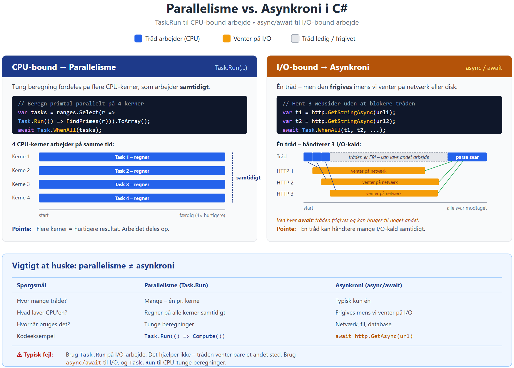

# CPU-bound og I/O-bound opgaver i C#

*Introduktion til parallelisme og asynkroni for 1. års datamatikere*

---

## 1. Indledning – hvorfor er det her vigtigt?

Når du skriver dit første C#-program, sker alt i én lang række af skridt. Programmet starter i `Main`, kører én linje ad gangen, og slutter når den sidste linje er udført. Det fungerer fint så længe programmet er lille og hurtigt.

Men virkelige programmer har en kedelig vane: de skal lave ting, der tager tid.

- En app skal hente data fra en webserver.
- Et script skal læse en stor fil fra harddisken.
- Et spil skal beregne fysik for tusindvis af objekter i hver frame.
- En rapport skal opsummere tusindvis af rækker fra en database.

Hvis dit program bare står og venter imens, oplever brugeren et "frosset" program. Hvis du har en server, der håndterer mange brugere, kan den kun svare én ad gangen. Det er her, begreberne **CPU-bound**, **I/O-bound**, **parallelisme** og **asynkroni** kommer ind.

Målet med dette dokument er, at du efter at have læst det:

- forstår hvorfor nogle opgaver er "CPU-bound" og andre er "I/O-bound",
- kan forklare forskellen på parallelisme og asynkroni,
- ved hvornår du skal bruge `Task.Run` og hvornår du skal bruge `async`/`await`,
- kan skrive enkle C#-programmer, der bruger begge dele korrekt.

Vi starter helt fra bunden – du behøver ikke have hørt om `Task` før.

---

## 2. Grundbegreber: CPU, tråd og program

Før vi kan tale om CPU-bound versus I/O-bound, har vi brug for tre begreber på plads.

### 2.1 CPU'en

CPU'en (Central Processing Unit) er den chip i computeren, der udfører instruktioner. Moderne computere har **flere kerner** (cores) – typisk 4, 8 eller 16. Hver kerne er i princippet en CPU, der kan arbejde selvstændigt. Det betyder, at en moderne computer faktisk kan udføre flere ting *samtidigt*, én på hver kerne.

### 2.2 Tråden

En **tråd** (thread) er en sekvens af instruktioner, som CPU'en kan udføre. Du kan tænke på en tråd som "én kok i køkkenet": den gør én ting ad gangen.

Når dit C#-program starter, får det én tråd – hovedtråden. Det er den, der kører din `Main`-metode. Hvis du kun har én tråd, kan CPU'en kun lave én ting fra dit program ad gangen.

Vi kan oprette flere tråde, hvis vi har brug for det. Hver tråd kan køre på sin egen CPU-kerne, og så arbejder de samtidigt.

### 2.3 Programmet

Et program er samlingen af kode, tråde og data, som kører sammen. Dit program kan sagtens have mange tråde, selvom du ikke selv har skrevet noget om det – styresystemet (Windows, Linux, macOS) har sine egne tråde, og `.NET`-runtime har også nogle.

> **Kort opsummering:** CPU'en har kerner, kernerne kører tråde, og tråde er bare rækker af instruktioner. Dit program starter med én tråd, men kan bede om flere.

---

## 3. CPU-bound og I/O-bound opgaver

Enhver opgave, din computer skal udføre, kan groft sagt inddeles i to typer, baseret på hvad **flaskehalsen** er.

### 3.1 CPU-bound opgaver

En **CPU-bound** opgave er en opgave, hvor CPU'en er fuldt optaget af at regne. Flaskehalsen er CPU'ens ydeevne. Hvis du havde en hurtigere CPU, ville opgaven blive færdig hurtigere.

Typiske eksempler:

- Finde alle primtal op til 1.000.000.
- Kryptere en stor fil.
- Komprimere et billede eller en video.
- Sortere et array med en million elementer.
- Beregne fysik i et spil.

Kendetegnet er, at opgaven består af **beregninger**. CPU'en står ikke og venter på noget udefra – den har nok at lave hele tiden.

### 3.2 I/O-bound opgaver

En **I/O-bound** opgave er en opgave, hvor det meste af tiden går med at vente på noget udenfor CPU'en. I/O står for "Input/Output". Flaskehalsen er ikke CPU'en, men fx netværket, harddisken eller databasen.

Typiske eksempler:

- Hente en webside med `HttpClient`.
- Læse fra eller skrive til en fil på disken.
- Lave en forespørgsel til en database.
- Vente på et svar fra en bruger.

Lad os sætte tal på. Hvis du henter en webside, tager det måske 200 millisekunder. I de 200 ms arbejder din CPU i under 1 ms (at pakke forespørgslen og pakke svaret ud) – resten af tiden sidder den bare og venter på, at netværket svarer. CPU'en er altså **næsten inaktiv**, selvom opgaven ikke er færdig.

### 3.3 Kok-analogien

En tommelfingerregel: forestil dig en kok i et køkken.

- **CPU-bound** = kokken hakker grøntsager i 30 minutter. Han arbejder konstant. Flere kokke ville gøre det hurtigere.
- **I/O-bound** = kokken sætter vand over til at koge og venter på det. Han kan lige så godt bruge ventetiden på noget andet.

### 3.4 Hvorfor er forskellen vigtig?

Den vigtige pointe er denne: **de to typer opgaver skal håndteres forskelligt, hvis vi vil have god ydeevne**.

- CPU-bound opgaver bliver hurtigere af at blive fordelt på flere kerner (**parallelisme**).
- I/O-bound opgaver bliver hurtigere af, at vi ikke spilder tråden på at stå og vente (**asynkroni**).

I de næste afsnit ser vi hvorfor.

---

## 4. Problemet med synkron kode

Lad os se på et helt almindeligt C#-program:

```csharp
public static void Main()
{
    string data1 = DownloadFromServer("https://api.example.com/users");
    string data2 = DownloadFromServer("https://api.example.com/orders");
    string data3 = DownloadFromServer("https://api.example.com/products");

    Console.WriteLine("Færdig!");
}
```

Det her program er **synkront**: linjerne udføres én ad gangen. Hvis hver `DownloadFromServer` tager 1 sekund, tager hele programmet 3 sekunder. I mellemtiden sidder tråden og venter. Den laver ingenting.

Hvis programmet havde en brugerflade, ville UI'et være **frosset** i de 3 sekunder. Brugeren kan ikke klikke, scrolle eller interagere.

Og hvis vi er på en server, der skal håndtere 1000 brugere samtidigt? Så har vi brug for 1000 tråde, der alle sidder og venter på netværket. Det er enormt spild af ressourcer.

Der er to måder at løse det her problem på.

---

## 5. To løsninger: parallelisme og asynkroni

De her to begreber bliver ofte blandet sammen, men de er **ikke** det samme.

### 5.1 Parallelisme

**Parallelisme** = flere ting sker samtidigt, fordi vi bruger flere kerner eller tråde.

Eksempel: Vi har 4 CPU-kerner og en tung beregning. Vi deler beregningen op i 4 dele og beder hver kerne om at regne på sin del. Resultatet bliver færdigt ca. 4 gange hurtigere.

```
Kerne 1: [=========================]
Kerne 2: [=========================]   alle regner på samme tid
Kerne 3: [=========================]
Kerne 4: [=========================]
```

Parallelisme giver mest mening til **CPU-bound** opgaver, fordi vi faktisk har mere arbejde at lave på kernerne.

### 5.2 Asynkroni

**Asynkroni** = én tråd kan håndtere flere ting ved at skifte mellem dem, når den ellers ville stå og vente.

Eksempel: Vi starter 3 netværkskald. I stedet for at tråden venter på hvert svar, siger den "start denne forespørgsel, men lad mig vide når du er færdig". Tråden kan så gå videre og lave andet (fx opdatere UI). Når et svar kommer, tager tråden det op igen.

```
Tråd:   [#][#][#]................[=========]
HTTP 1:    [--venter på net------]
HTTP 2:       [--venter på net------]
HTTP 3:          [--venter på net------]
```

`[#]` = tråden arbejder, `.` = tråden er fri (kan lave andet), `--` = venter på netværk.

Asynkroni giver mest mening til **I/O-bound** opgaver, fordi den dyrebare tid går med at vente – og vi sparer ved ikke at blokere tråden mens vi venter.

### 5.3 De to begreber side om side

| Spørgsmål | Parallelisme | Asynkroni |
|---|---|---|
| Antal tråde | Mange (én pr. kerne) | Typisk én |
| Formål | Udnytte flere kerner | Undgå at blokere på ventetid |
| Egnet til | CPU-bound opgaver | I/O-bound opgaver |
| I C# med | `Task.Run(...)` | `async` / `await` |

De to kan kombineres. I praksis bruger du ofte begge dele i det samme program.

---

## 6. `Task`-begrebet i C#

I C# er `Task` et objekt, der repræsenterer **noget arbejde, der enten er i gang eller bliver færdigt senere**.

Du kan tænke på en `Task` som en kupon: du får den, når du bestiller noget, og du kan hente det bestilte, når kuponen bliver "rød" (fuldført).

Der er to hovedformer:

```csharp
Task         // arbejde der ikke returnerer en værdi
Task<string> // arbejde der vil returnere en string, når det er færdigt
```

En `Task` kan ende i tre tilstande:

- **RanToCompletion** – arbejdet er færdigt.
- **Faulted** – arbejdet kastede en exception.
- **Canceled** – arbejdet blev annulleret.

Man kan **vente** på en `Task` med `await`. Når man skriver `await someTask`, siger man: "fortsæt her, når denne Task er færdig – men bloker ikke tråden imens".

Vi vender tilbage til `await` i afsnit 8.

---

## 7. `Task.Run` – parallelisme til CPU-bound arbejde

`Task.Run` er den mest direkte måde at starte arbejde på en anden tråd i C#.

### 7.1 Den simple form

```csharp
Task<long> task = Task.Run(() => SumOfPrimesBelow(10_000_000));
long result = await task;
Console.WriteLine($"Sum: {result}");
```

Det her gør følgende:

1. `Task.Run` beder .NET om at tage en tråd fra **thread pool'en** (en pulje af genbrugte tråde).
2. Tråden begynder at køre `SumOfPrimesBelow(10_000_000)` på en anden kerne.
3. Vores egen tråd fortsætter og kan lave andet (eller `await` resultatet).
4. Når beregningen er færdig, får vi `long`-værdien tilbage.

### 7.2 Parallel beregning

Den virkelige styrke dukker op, når vi starter flere tasks på én gang:

```csharp
int[] ranges = { 0, 250_000, 500_000, 750_000, 1_000_000 };

// Start 4 tasks, én for hvert interval
Task<long>[] tasks = new Task<long>[4];
for (int i = 0; i < 4; i++)
{
    int from = ranges[i];
    int to = ranges[i + 1];
    tasks[i] = Task.Run(() => SumOfPrimesBetween(from, to));
}

// Vent til alle er færdige
long[] partialSums = await Task.WhenAll(tasks);
long total = partialSums.Sum();
```

Hvis computeren har 4 kerner, regner alle fire tasks **samtidigt**. Arbejdet bliver ca. 4 gange hurtigere (aldrig helt, fordi der er overhead).

### 7.3 Hvornår skal jeg bruge `Task.Run`?

**Kun** når opgaven er CPU-bound. Dvs. det er ren beregning, og CPU'en har faktisk noget at lave hele tiden.

Brug **ikke** `Task.Run` til at "gøre" en I/O-operation asynkron. Det er en af de mest almindelige fejl (mere om det i afsnit 11).

---

## 8. `async` og `await` – asynkroni til I/O-bound arbejde

Nu til den anden halvdel. Når opgaven er I/O-bound – altså vi venter på netværk, disk eller database – er svaret `async`/`await`.

### 8.1 Et minimalt eksempel

```csharp
public static async Task<string> HentWebsideAsync(string url)
{
    using HttpClient client = new HttpClient();
    string html = await client.GetStringAsync(url);
    return html;
}
```

To nye ord er dukket op: `async` og `await`. Lad os forstå dem.

### 8.2 `async` – "denne metode kan suspenderes"

Når du skriver `async` foran en metode, fortæller du compileren: "denne metode kan have `await` i sig, og compileren skal omforme den til en tilstandsmaskine." Returtypen er typisk `Task` eller `Task<T>`.

Du skriver ikke selv noget særligt for at returnere – du skriver bare `return html;` som om metoden returnerede `string`, og compileren pakker det ind i en `Task<string>`.

### 8.3 `await` – "vent, men frigiv tråden imens"

`await` er hjertet i det hele. Når du skriver:

```csharp
string html = await client.GetStringAsync(url);
```

så sker følgende:

1. `GetStringAsync(url)` sender forespørgslen og returnerer en `Task<string>` med det samme. Den **venter ikke** på svaret.
2. `await` ser at den Task ikke er færdig endnu.
3. Tråden bliver **frigivet**. Den kan nu køre anden kode (andre requests, UI-events, you name it).
4. Når svaret kommer tilbage fra serveren, bliver metoden "vækket" igen, og resten af koden kører videre.

Det vigtige er: mens vi venter, står tråden **ikke** stille. Den bliver frigivet og kan lave andet. Det er forskellen på `await` og en almindelig blokerende venten.

### 8.4 Flere I/O-kald samtidigt

Lad os hente tre sider samtidigt uden parallelisme (kun én tråd!):

```csharp
public static async Task<string[]> HentAlleAsync()
{
    using HttpClient client = new HttpClient();

    // Start alle tre kald – de kører nu samtidigt i netværket
    Task<string> t1 = client.GetStringAsync("https://api.example.com/users");
    Task<string> t2 = client.GetStringAsync("https://api.example.com/orders");
    Task<string> t3 = client.GetStringAsync("https://api.example.com/products");

    // Vent til alle svar er kommet
    string[] results = await Task.WhenAll(t1, t2, t3);
    return results;
}
```

Hvis hvert kald tager 1 sekund, tager hele metoden **ca. 1 sekund** – ikke 3. Ikke fordi vi har 3 tråde, men fordi alle 3 forespørgsler ligger ude på netværket samtidigt, og vores tråd venter på dem alle på én gang.

### 8.5 "Async all the way"

En vigtig regel: hvis en metode `await`'er noget, skal den selv være `async`, og dens kald skal også `await`'es. Det betyder, at `async` smitter op gennem dit program – deraf udtrykket "async all the way".

```csharp
// Bund
public async Task<string> HentAsync() { ... }

// Mellemlag
public async Task<User> HentBrugerAsync()
{
    string json = await HentAsync();
    return JsonSerializer.Deserialize<User>(json)!;
}

// Top (fx i Main eller en controller)
public async Task Main()
{
    User u = await HentBrugerAsync();
    Console.WriteLine(u.Navn);
}
```

---

## 9. Koordination af flere Tasks

Når du har flere Tasks i gang, er der to hjælpefunktioner, du bør kende.

### 9.1 `Task.WhenAll`

Venter på, at **alle** tasks er færdige. Returnerer et array med alle resultaterne (eller bare en ensom `Task` hvis ingen har returværdi).

```csharp
Task<string>[] tasks = urls.Select(u => client.GetStringAsync(u)).ToArray();
string[] svar = await Task.WhenAll(tasks);
```

### 9.2 `Task.WhenAny`

Venter på, at **én** task er færdig – den første, der bliver klar. God hvis du fx vil bruge det første svar, der kommer, eller vil implementere en timeout.

```csharp
Task<string> svar = client.GetStringAsync(url);
Task timeout = Task.Delay(5000);

Task first = await Task.WhenAny(svar, timeout);
if (first == timeout)
    throw new TimeoutException("Serveren svarede ikke inden for 5 sekunder");
string html = await svar;
```

---

## 10. Fejlhåndtering og annullering

Kort om to praktiske ting, du kommer til at støde på.

### 10.1 Exceptions i Tasks

Hvis koden inde i en `Task` kaster en exception, bliver exception'en "gemt" i task'en. Den bliver først kastet, når du skriver `await` på task'en:

```csharp
try
{
    string html = await client.GetStringAsync("https://ikke-en-rigtig-url");
}
catch (HttpRequestException ex)
{
    Console.WriteLine($"Fejl: {ex.Message}");
}
```

### 10.2 Annullering med `CancellationToken`

Når en opgave tager lang tid, vil du ofte have mulighed for at **annullere** den – fx hvis brugeren lukker vinduet.

```csharp
using CancellationTokenSource cts = new CancellationTokenSource();
cts.CancelAfter(TimeSpan.FromSeconds(5));

string html = await client.GetStringAsync(url, cts.Token);
```

`CancellationToken` er en standardmekanisme, både `Task.Run` og de fleste `async`-metoder understøtter.

---

## 11. Typiske faldgruber

Her er fire klassiske fejl, du skal undgå.

### 11.1 `Task.Run` på I/O-arbejde

```csharp
// FORKERT
string html = await Task.Run(() => client.GetString(url));
```

Det her hjælper ingenting. Du har blot flyttet en blokerende venten til en anden tråd. Nu har du to tråde i stedet for én, der står og venter – endnu værre end før.

**Rigtigt:** brug den `Async`-version direkte.

```csharp
string html = await client.GetStringAsync(url);
```

### 11.2 `.Result` eller `.Wait()` på en Task

```csharp
// FARLIGT – kan give deadlock i UI-apps
string html = client.GetStringAsync(url).Result;
```

Det blokerer tråden på samme måde som synkron kode – og kan endda give deadlocks i visse typer applikationer. **Brug altid `await` hvis du kan.**

### 11.3 Glemt `await`

```csharp
// SUBTIL FEJL
public async Task GemDataAsync(string data)
{
    File.WriteAllTextAsync("data.txt", data);   // mangler await!
    Console.WriteLine("Gemt");
}
```

Her returnerer metoden før filen er skrevet. Ingen fejl, men din rækkefølge er forkert. Compileren advarer – lyt til den.

### 11.4 `async void`

```csharp
// Undgå – bortset fra event handlers
public async void GørNoget() { ... }
```

`async void` kan ikke `await`'es, exceptions kan ikke fanges normalt, og der er ingen måde at vide, hvornår metoden er færdig. Brug `async Task` i stedet. Eneste undtagelse: event handlers (`button_Click` osv.), fordi deres signatur kræver `void`.

---

## 12. Opsummering

Hele emnet kan koges ned til dette diagram:

```
Spørg dig selv: Hvad venter programmet på?

Venter på CPU-beregning          Venter på netværk/disk/database
         |                                |
         v                                v
    CPU-bound                        I/O-bound
         |                                |
         v                                v
    Parallelisme                     Asynkroni
         |                                |
         v                                v
    Task.Run(...)                    async / await
```

De fire ting du bør huske:

1. **CPU-bound** = CPU'en regner. **I/O-bound** = CPU'en venter.
2. **Parallelisme** = flere tråde/kerner arbejder samtidigt. Løser CPU-bound.
3. **Asynkroni** = én tråd frigives under ventetid. Løser I/O-bound.
4. Brug `Task.Run` til det første, `async`/`await` til det andet. Bland dem ikke sammen.


Opsummeret i figur:


---

## 13. Øvelser

### Øvelse 1 – Genkend opgavetypen

Er følgende opgaver CPU-bound eller I/O-bound?

1. Læs en CSV-fil med 50.000 rækker.
2. Beregn SHA-256 hash af en 1 GB fil.
3. Hent vejrdata fra et offentligt API.
4. Sorter 10 millioner tal.
5. Send en mail via SMTP.
6. Træn en lille machine learning-model.
7. Kald en stored procedure i SQL Server.

### Øvelse 2 – Reparer koden

Find fejlen:

```csharp
public async Task<string> HentAsync(string url)
{
    using HttpClient client = new HttpClient();
    string html = await Task.Run(() => client.GetStringAsync(url));
    return html;
}
```

### Øvelse 3 – Skriv din egen

Skriv en metode `HentFlereSiderAsync(string[] urls)`, der henter alle siderne **parallelt** (altså ikke én ad gangen) og returnerer deres længde i bytes som et `int[]`. Metoden må kun bruge én tråd til selve koordineringen.

### Øvelse 4 – Parallel beregning

Skriv en metode, der beregner sum af kvadrater fra 1 til 100.000.000, opdelt på 4 tasks, der kører parallelt med `Task.Run`. Mål tiden og sammenlign med en ikke-parallel version.

---

## Videre læsning

- Microsoft Docs: *Asynchronous programming with async and await* (learn.microsoft.com)
- Stephen Cleary: *Async and Await* – en klassisk blogartikel.
- Bogen *Concurrency in C# Cookbook* af Stephen Cleary.

---

*Dokumentet hører sammen med figuren `cpu_vs_io_bound.svg` / `.png`, der illustrerer de samme begreber grafisk.*
