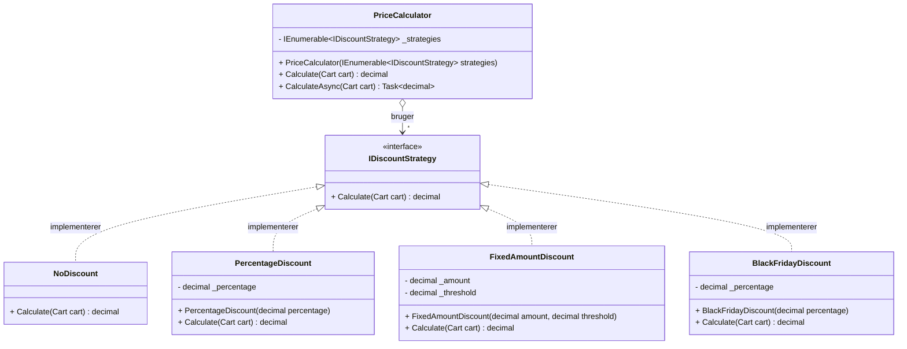

# Strategy mønsteret i C# (.NET 10)

> **Undervisningsmateriale – 1. semester, Datamatikeruddannelsen**
> Emne: Strategy-designmønster med rabatberegning, CPU-bound tasks og IoC
> Varighed: ca. 2 lektioner

---

## Indholdsfortegnelse

1. Indledning
2. Motivation – et problem uden Strategy
3. Hvad er Strategy-mønsteret?
4. UML-diagram (figur)
5. Domænet: Rabatberegning
6. Implementering i C# med .NET 10
7. CPU-bound afvikling med `Task.Run`
8. Samlet eksempel med `Program.cs`
9. Inversion of Control (IoC) og Dependency Injection
10. Enhedstest af strategierne
11. Fordele, ulemper og SOLID-perspektivet
12. Variant: delt rabat-resultat og race conditions
13. Opsummering og læringsmål

---

## 1. Indledning

Et *designmønster* er en generel, genbrugelig løsning på et tilbagevendende problem i softwaredesign. Designmønstre er **ikke** konkret kode, men en skabelon for, hvordan man strukturerer klasser og objekter for at løse et bestemt problem.

Strategy-mønsteret (på dansk ofte kaldet *strategi-mønsteret*) er et af de klassiske adfærdsmæssige (behavioral) mønstre fra den berømte bog *Design Patterns* af "Gang of Four" (Gamma, Helm, Johnson, Vlissides, 1994).

Formålet med dette dokument er at introducere Strategy-mønsteret gennem et praksisnært eksempel: beregning af rabat i en webshop. Kunden får altid **den bedste pris** – derfor afvikles *alle* strategier, og den bedste vælges. Samtidig viser vi, hvordan de enkelte rabatstrategier kan afvikles som *CPU-bound tasks*, så beregningerne udføres parallelt. Til sidst kobler vi mønsteret op på *Inversion of Control* (IoC), så vi kan registrere og udskifte strategier via den indbyggede dependency injection-container i .NET.

Efter at have læst materialet skal du kunne:

- Forklare problemet, som Strategy-mønsteret løser.
- Implementere mønsteret i C# ved hjælp af et interface og konkrete klasser.
- Begrunde, hvorfor mønsteret understøtter **Open/Closed Principle** (O'et i SOLID).
- Afvikle flere strategier som CPU-bound tasks og finde den bedste pris parallelt.
- Registrere strategier i en IoC-container og injecte dem via konstruktøren.

---

## 2. Motivation – et problem uden Strategy

Forestil dig, at du skal beregne prisen på en kundes indkøbskurv i en webshop. Der findes flere typer rabatter:

- **Ingen rabat** (standardkunder).
- **Procentrabat** (fx 10 % til medlemmer af loyalitetsklubben).
- **Fastbeløbsrabat** (fx 50 kr. ved køb over 300 kr.).
- **Mængderabat** (fx "køb 3, betal for 2").
- **Sæsonudsalg** (fx 25 % på udvalgte varer i Black Friday-ugen).

En uerfaren udvikler kunne fristes til at skrive noget i retning af følgende:

```csharp
public decimal CalculateTotal(Cart cart, string discountType)
{
    decimal total = cart.Subtotal();

    if (discountType == "None")
    {
        return total;
    }
    else if (discountType == "Percent")
    {
        return total * 0.90m;
    }
    else if (discountType == "FixedAmount")
    {
        return total >= 300m ? total - 50m : total;
    }
    else if (discountType == "BuyThreePayTwo")
    {
        // ... lang og indviklet logik
    }
    else if (discountType == "BlackFriday")
    {
        return total * 0.75m;
    }
    else
    {
        throw new ArgumentException("Ukendt rabattype");
    }
}
```

Denne kode har flere problemer:

1. **Høj kompleksitet i én metode** – jo flere rabattyper, desto mere uoverskuelig bliver metoden.
2. **Brud på Open/Closed Principle** – hver gang der skal tilføjes en ny rabattype, skal den eksisterende metode ændres (og dermed risikerer vi at bryde testet, eksisterende kode).
3. **Svær at teste** – vi kan ikke teste rabatberegningen i isolation; vi skal altid gå gennem `CalculateTotal`.
4. **Brud på Single Responsibility Principle** – klassen der ejer metoden, får nu ansvar for *alle* rabattyper.
5. **Vanskelig at genbruge** – hvis to forskellige dele af systemet skal bruge samme rabatlogik, ender vi typisk med at kopiere koden.

Strategy-mønsteret løser netop disse problemer.

---

## 3. Hvad er Strategy-mønsteret?

**Definition** *(Gang of Four)*:

> *"Define a family of algorithms, encapsulate each one, and make them interchangeable. Strategy lets the algorithm vary independently from clients that use it."*

På dansk: Strategy-mønsteret definerer en familie af algoritmer, pakker hver algoritme ind i sin egen klasse, og gør dem udskiftelige på runtime. Klienten, der bruger algoritmen, behøver ikke at vide, hvilken konkret algoritme der udføres – kun at den overholder en fælles kontrakt (typisk et interface).

Mønsteret består af tre hovedroller:

- **Strategy** – et interface (eller abstrakt klasse), der definerer den fælles kontrakt for alle algoritmer.
- **ConcreteStrategy** – konkrete implementationer af interfacet. Hver klasse implementerer én variation af algoritmen.
- **Context** – klassen, der bruger strategierne. Den holder en reference til *Strategy*-interfacet (typisk som en samling) og orkestrerer udførelsen.

I vores tilfælde er:

| Rolle              | Klasse/interface            |
|--------------------|------------------------------|
| Strategy           | `IDiscountStrategy`          |
| ConcreteStrategy   | `NoDiscount`, `PercentageDiscount`, `FixedAmountDiscount`, `BlackFridayDiscount` |
| Context            | `PriceCalculator`            |

---

## 4. UML-diagram (figur)

Nedenstående UML-klassediagram viser strukturen i Strategy-mønsteret, anvendt på vores rabat-eksempel. Diagrammet er skrevet i **Mermaid** og kan renderes direkte i VS Code, GitHub og Azure DevOps.



**Læs diagrammet sådan:**

- `PriceCalculator` (Context) har en reference til en **samling** af `IDiscountStrategy` (komposition med multiplicitet `*`).
- De fire konkrete klasser realiserer (implementerer) interfacet.
- Bemærk pilen fra `PriceCalculator` til `IDiscountStrategy`: Context kender kun interfacet, aldrig de konkrete klasser. **Dette er kernen i mønsteret.**

---

## 5. Domænet: Rabatberegning

Inden vi kaster os over koden, modellerer vi domænet kort.

**Entiteter:**

- `CartLine` – en linje i en kurv, bestående af et produktnavn, en stykpris og et antal.
- `Cart` – en kurv, der består af en liste af `CartLine`-objekter.
- `IDiscountStrategy` – algoritmen, der beregner, hvor meget rabat der gives på en kurv.

Alle beløb håndteres som `decimal` i DKK. `decimal` er det korrekte valg i C# til penge, fordi det regner præcist med decimaltal (til forskel fra `double` og `float`, der bruger binær flydende komma og kan give afrundingsfejl).

```csharp
public sealed record CartLine(string Product, decimal UnitPrice, int Quantity)
{
    public decimal LineTotal => UnitPrice * Quantity;
}

public sealed class Cart
{
    private readonly List<CartLine> _lines = new();

    public IReadOnlyList<CartLine> Lines => _lines;

    public void Add(CartLine line) => _lines.Add(line);

    public decimal Subtotal() => _lines.Sum(l => l.LineTotal);
}
```

> **Bemærk**: Vi bruger `record` til `CartLine`, fordi det er et lille, uforanderligt værdiobjekt. `record`-syntaksen giver os gratis `Equals`, `GetHashCode` og `ToString`.

---

## 6. Implementering i C# med .NET 10

### 6.1 Strategien (interfacet)

Hjertet i mønsteret er interfacet. Det definerer én enkelt operation: "beregn rabatten på en kurv".

```csharp
namespace WebShop.Pricing;

public interface IDiscountStrategy
{
    /// <summary>
    /// Beregner den rabat, som strategien tildeler den givne kurv.
    /// Returværdien er selve rabat-beløbet (ikke den endelige pris).
    /// </summary>
    decimal Calculate(Cart cart);
}
```

Vi har bevidst valgt, at metoden returnerer **rabatten**, ikke den endelige pris. På den måde bliver det tydeligt, hvad strategien har ansvar for, og `PriceCalculator` kan trække rabatten fra subtotalen.

### 6.2 Konkrete strategier

```csharp
public sealed class NoDiscount : IDiscountStrategy
{
    public decimal Calculate(Cart cart) => 0m;
}

public sealed class PercentageDiscount : IDiscountStrategy
{
    private readonly decimal _percentage;

    public PercentageDiscount(decimal percentage)
    {
        if (percentage < 0 || percentage > 1)
            throw new ArgumentOutOfRangeException(nameof(percentage),
                "Procenten skal angives som decimal mellem 0 og 1, fx 0.10 for 10 %.");

        _percentage = percentage;
    }

    public decimal Calculate(Cart cart) => cart.Subtotal() * _percentage;
}

public sealed class FixedAmountDiscount : IDiscountStrategy
{
    private readonly decimal _amount;
    private readonly decimal _threshold;

    public FixedAmountDiscount(decimal amount, decimal threshold)
    {
        _amount = amount;
        _threshold = threshold;
    }

    public decimal Calculate(Cart cart)
        => cart.Subtotal() >= _threshold ? _amount : 0m;
}

public sealed class BlackFridayDiscount : IDiscountStrategy
{
    private readonly decimal _percentage;

    public BlackFridayDiscount(decimal percentage = 0.25m)
    {
        _percentage = percentage;
    }

    public decimal Calculate(Cart cart) => cart.Subtotal() * _percentage;
}
```

Hver strategi er ganske lille, og hver klasse har ét klart ansvar. Hvis du om et år skal tilføje en ny rabattype (fx `StudentDiscount`), behøver du **ikke at ændre eksisterende klasser** – du tilføjer blot en ny.

### 6.3 Context – `PriceCalculator` (best price over alle strategier)

I vores webshop vil vi altid give kunden **den bedste pris**. Det betyder, at `PriceCalculator` skal køre *alle* registrerede strategier og vælge den, der giver størst rabat (dvs. lavest slutpris). Context'en får derfor en **samling** af strategier ind i konstruktøren, ikke kun én.

```csharp
public sealed class PriceCalculator
{
    private readonly IReadOnlyList<IDiscountStrategy> _strategies;

    public PriceCalculator(IEnumerable<IDiscountStrategy> strategies)
    {
        ArgumentNullException.ThrowIfNull(strategies);

        _strategies = strategies.ToList();

        if (_strategies.Count == 0)
            throw new ArgumentException(
                "Der skal være mindst én strategi.", nameof(strategies));
    }

    /// <summary>
    /// Kører alle strategier og returnerer den bedste (laveste) pris.
    /// </summary>
    public decimal Calculate(Cart cart)
    {
        ArgumentNullException.ThrowIfNull(cart);

        var subtotal = cart.Subtotal();
        var bestDiscount = _strategies
            .Select(s => s.Calculate(cart))
            .Max();

        return subtotal - bestDiscount;
    }
}
```

Læg mærke til følgende:

- `PriceCalculator` *kender* kun interfacet `IDiscountStrategy`. Den har **ingen** `if/else` eller `switch` for at finde ud af, hvilken rabat der skal gælde.
- Strategier kan tilføjes, fjernes eller erstattes udefra – `PriceCalculator` skal ikke ændres.
- Klassen er `sealed` – en god default, der forhindrer arv og dermed utilsigtet ændret adfærd.
- Vi vælger **max rabat** = **min slutpris**. Det er her selve "best price"-logikken sidder.

---

## 7. CPU-bound afvikling med `Task.Run`

### 7.1 Hvad er CPU-bound arbejde?

Man skelner traditionelt mellem to typer af arbejde:

- **I/O-bound**: arbejde, der bruger tid på at *vente* – fx på en database, et netværkskald, eller en fil på disken. Her er CPU'en for det meste ledig.
- **CPU-bound**: arbejde, der bruger tid på at *regne* – fx tunge beregninger, billedbehandling, eller store aggregeringer. Her arbejder CPU'en aktivt hele tiden.

For I/O-bound arbejde bruger man typisk `async/await` med *asynkrone* API'er (fx `HttpClient.GetAsync`). For CPU-bound arbejde kan man bruge `Task.Run` til at flytte arbejdet væk fra den kaldende tråd og udnytte flere CPU-kerner parallelt.

### 7.2 Parallel best-price-beregning

Vores enkelte rabatberegninger er i sig selv ikke særligt tunge. Men forestil dig, at en strategi i virkeligheden fx skal konsultere en machine-learning-model eller beregne personlige tilbud ud fra kundens købshistorik. Det kan sagtens tage flere hundrede millisekunder CPU-tid pr. strategi. Da strategierne er **uafhængige** af hinanden (én strategi læser ikke andres resultat), er de oplagte kandidater til at køre parallelt.

Vi udvider `PriceCalculator` med en `CalculateAsync`-metode, som starter én `Task.Run` pr. strategi og samler resultaterne med `Task.WhenAll`:

```csharp
public sealed class PriceCalculator
{
    private readonly IReadOnlyList<IDiscountStrategy> _strategies;

    public PriceCalculator(IEnumerable<IDiscountStrategy> strategies)
    {
        ArgumentNullException.ThrowIfNull(strategies);
        _strategies = strategies.ToList();
        if (_strategies.Count == 0)
            throw new ArgumentException("Mindst én strategi kræves.", nameof(strategies));
    }

    /// <summary>
    /// Synkron best-price-beregning (se afsnit 6.3).
    /// </summary>
    public decimal Calculate(Cart cart)
    {
        ArgumentNullException.ThrowIfNull(cart);
        var bestDiscount = _strategies.Select(s => s.Calculate(cart)).Max();
        return cart.Subtotal() - bestDiscount;
    }

    /// <summary>
    /// Afvikler alle strategier parallelt som CPU-bound tasks
    /// og returnerer den bedste (laveste) pris.
    /// </summary>
    public async Task<decimal> CalculateAsync(Cart cart, CancellationToken ct = default)
    {
        ArgumentNullException.ThrowIfNull(cart);

        // Én task pr. strategi – kører på ThreadPool'en og kan fordeles
        // over flere CPU-kerner, hvis de er ledige.
        var tasks = _strategies
            .Select(s => Task.Run(() =>
            {
                ct.ThrowIfCancellationRequested();
                return s.Calculate(cart);
            }, ct))
            .ToArray();

        var discounts = await Task.WhenAll(tasks);
        return cart.Subtotal() - discounts.Max();
    }
}
```

**Hvorfor er det en god ide?**

- *Alle* rabatstrategier udnytter CPU'en parallelt. Hvis én strategi tager 200 ms, kan vi stadig have svar på 4 strategier efter ca. 200 ms (i stedet for 800 ms) – forudsat at der er ledige CPU-kerner.
- `Task.WhenAll` venter på alle tasks. Hvis én fejler, propagerer exception'en naturligt ud.
- `CancellationToken` betyder, at hele beregningen kan afbrydes fx ved en timeout.

**Vigtig pointe**: `Task.Run` bør kun bruges til *CPU-bound* arbejde. Brug det aldrig oven på et `async`-kald, der allerede er I/O-bound – der laver du blot unødvendigt tråd-skift. Hvis du er i tvivl, er reglen: *"Async all the way"* for I/O-bound, og `Task.Run` kun hvor du ved, at beregningen belaster CPU'en.

---

## 8. Samlet eksempel med `Program.cs`

I .NET 10 kan en konsol-app bruge *top-level statements*. Her er et komplet eksempel, der demonstrerer best-price-beregning på tværs af alle strategier:

```csharp
using WebShop.Pricing;

// Opbyg en kurv
var cart = new Cart();
cart.Add(new CartLine("Kaffebønner 1 kg", 120m, 2));
cart.Add(new CartLine("Kaffekværn",       499m, 1));
cart.Add(new CartLine("Filter",           45m,  3));

Console.WriteLine($"Subtotal: {cart.Subtotal():0.00} DKK");

// Alle tilgængelige rabatstrategier
IDiscountStrategy[] strategies =
[
    new NoDiscount(),
    new PercentageDiscount(0.10m),
    new FixedAmountDiscount(amount: 50m, threshold: 300m),
    new BlackFridayDiscount(0.25m)
];

// Context'en får alle strategier ind
var calculator = new PriceCalculator(strategies);

// Kør alle parallelt som CPU-bound tasks og få den bedste pris
using var cts = new CancellationTokenSource(TimeSpan.FromSeconds(5));
var bestPrice = await calculator.CalculateAsync(cart, cts.Token);

Console.WriteLine($"Bedste pris til kunden: {bestPrice:0.00} DKK");

// Vil vi også se hver enkelt strategi (fx i en fakturakladde),
// kan vi køre dem igennem manuelt:
Console.WriteLine("\nDetaljer pr. strategi:");
foreach (var s in strategies)
{
    var discount = s.Calculate(cart);
    var total    = cart.Subtotal() - discount;
    Console.WriteLine(
        $"  {s.GetType().Name,-22} rabat: {discount,7:0.00}  slutpris: {total,7:0.00} DKK");
}
```

**Eksempel på output** (subtotal 120·2 + 499 + 45·3 = 874 DKK):

```
Subtotal: 874,00 DKK
Bedste pris til kunden: 655,50 DKK

Detaljer pr. strategi:
  NoDiscount             rabat:    0,00  slutpris:  874,00 DKK
  PercentageDiscount     rabat:   87,40  slutpris:  786,60 DKK
  FixedAmountDiscount    rabat:   50,00  slutpris:  824,00 DKK
  BlackFridayDiscount    rabat:  218,50  slutpris:  655,50 DKK
```

Kunden får altså Black Friday-prisen, fordi det er den strategi, der giver størst rabat. `PriceCalculator` har ikke behøvet at vide *hvilken* strategi der vandt – den har blot afviklet dem alle og taget den bedste.

---

## 9. Inversion of Control (IoC) og Dependency Injection

### 9.1 Hvad er IoC?

I traditionel kode bestemmer *klienten* selv, hvilke konkrete objekter den bruger – typisk ved at skrive `new` direkte:

```csharp
var calculator = new PriceCalculator(new[] { new PercentageDiscount(0.10m) });
```

Med *Inversion of Control* vendes styringen på hovedet: i stedet for at en klasse selv opretter sine afhængigheder, får den dem **leveret udefra**, ofte gennem konstruktøren. Det kaldes i praksis *Constructor Injection*, og det er den mest udbredte form for *Dependency Injection* (DI) – som igen er den mest udbredte måde at implementere IoC på.

Vi har allerede bygget vores kode klar til IoC ved at lade `PriceCalculator` tage en `IEnumerable<IDiscountStrategy>` ind i konstruktøren. Nu mangler vi bare selve **IoC-containeren**, som holder styr på, hvilke konkrete klasser der skal bruges.

.NET 10 kommer med en indbygget container i pakken `Microsoft.Extensions.DependencyInjection`. Det er den samme container, som ASP.NET Core, Worker Services, .NET Aspire m.fl. bruger.

### 9.2 Registrering af flere strategier

Når vi registrerer `IDiscountStrategy` flere gange, kan `PriceCalculator` automatisk få injectet en `IEnumerable<IDiscountStrategy>` med *alle* registreringer. Det passer som fod i hose med vores best-price-design:

```csharp
using Microsoft.Extensions.DependencyInjection;
using WebShop.Pricing;

var services = new ServiceCollection();

// Alle strategier registreres bag det SAMME interface.
// Containeren kan så levere dem som en samling.
services.AddSingleton<IDiscountStrategy, NoDiscount>();
services.AddSingleton<IDiscountStrategy>(_ => new PercentageDiscount(0.10m));
services.AddSingleton<IDiscountStrategy>(_ => new FixedAmountDiscount(50m, 300m));
services.AddSingleton<IDiscountStrategy>(_ => new BlackFridayDiscount(0.25m));

// Context'en. Den får AUTOMATISK en IEnumerable<IDiscountStrategy>
// med alle fire strategier ind i konstruktøren.
services.AddSingleton<PriceCalculator>();

using var provider = services.BuildServiceProvider();

// Hent context'en ud af containeren og brug den
var calculator = provider.GetRequiredService<PriceCalculator>();

var cart = new Cart();
cart.Add(new CartLine("Kaffe", 120m, 2));

var bestPrice = await calculator.CalculateAsync(cart);
Console.WriteLine($"Bedste pris: {bestPrice:0.00} DKK");
```

**Pointerne her:**

- Vi skriver **ikke** `new PriceCalculator(...)`. Containeren gør det for os og fylder automatisk alle de registrerede `IDiscountStrategy`-instanser ind i konstruktøren.
- Skal vi tilføje en ny rabat (fx `StudentDiscount`)? Opret klassen og tilføj én linje til registreringen. `PriceCalculator` og alle de andre klasser forbliver urørte. **Dette er Open/Closed Principle i praksis.**
- `AddSingleton` betyder, at der kun oprettes ét objekt pr. applikation. Andre livstider er `AddScoped` (ét objekt pr. scope, fx pr. HTTP-request) og `AddTransient` (et nyt objekt hver gang).

### 9.3 Hvorfor er det godt?

- **Løs kobling**: `PriceCalculator` kender hverken `ServiceCollection` eller de konkrete strategier.
- **Dependency Inversion Principle (DIP)** overholdes fuldt ud: context'en afhænger kun af abstraktionen `IDiscountStrategy`.
- **Testbarhed**: I en unit test kan vi konstruere `PriceCalculator` direkte med en *fake* samling af strategier uden at involvere containeren overhovedet.
- **Konfiguration ét sted**: Al "hvilken klasse kobles på hvilket interface" står samlet i *Composition Root* (typisk `Program.cs`). Det er præcis den disciplin, som *Clean Architecture* og DDD anbefaler.

> **Bonus**: I .NET Aspire og ASP.NET Core er `IServiceCollection` allerede opsat for dig via `builder.Services`. Du skal altså ikke selv oprette containeren – du skal blot kalde `builder.Services.AddSingleton<IDiscountStrategy, ...>()` for hver strategi i dit `Program.cs`.

---

## 10. Enhedstest af strategierne

Én af styrkerne ved Strategy-mønsteret er, at hver strategi kan testes i fuldstændig isolation. Her er et par xUnit-tests:

```csharp
using Xunit;
using WebShop.Pricing;

public class PercentageDiscountTests
{
    [Fact]
    public void Calculate_TenPercent_Returns10PercentOfSubtotal()
    {
        // Arrange
        var cart = new Cart();
        cart.Add(new CartLine("Bog", 100m, 2)); // subtotal = 200
        var strategy = new PercentageDiscount(0.10m);

        // Act
        var discount = strategy.Calculate(cart);

        // Assert
        Assert.Equal(20m, discount);
    }

    [Theory]
    [InlineData(-0.1)]
    [InlineData(1.5)]
    public void Constructor_InvalidPercentage_Throws(decimal percentage)
    {
        Assert.Throws<ArgumentOutOfRangeException>(
            () => new PercentageDiscount(percentage));
    }
}

public class PriceCalculatorTests
{
    [Fact]
    public async Task CalculateAsync_ReturnsBestPriceAcrossAllStrategies()
    {
        var cart = new Cart();
        cart.Add(new CartLine("T-shirt", 250m, 4)); // subtotal = 1000

        // 10 %, 50 kr. fast over 300, og ingen rabat
        var calculator = new PriceCalculator(new IDiscountStrategy[]
        {
            new NoDiscount(),
            new PercentageDiscount(0.10m),         // rabat = 100
            new FixedAmountDiscount(50m, 300m)     // rabat = 50
        });

        var bestPrice = await calculator.CalculateAsync(cart);

        // Forventet: PercentageDiscount vinder med rabat 100 -> slutpris 900
        Assert.Equal(900m, bestPrice);
    }
}
```

Læg mærke til, at vi kan teste `PriceCalculator` ved at give den præcis dét sæt strategier, testet skal dække. Vi behøver ikke mocke en database, et webkald eller noget andet – det er netop fordi mønsteret afkobler *hvordan* (strategien) fra *hvornår* (konteksten).

---

## 11. Fordele, ulemper og SOLID-perspektivet

### 11.1 Fordele

- **Open/Closed Principle (OCP)**: Ny rabatlogik tilføjes ved at oprette en ny klasse (og registrere den i IoC-containeren), ikke ved at ændre eksisterende kode.
- **Single Responsibility Principle (SRP)**: Hver strategi har ét tydeligt ansvar.
- **Liskov Substitution Principle (LSP)**: Alle konkrete strategier kan bruges, hvor interfacet forventes.
- **Dependency Inversion Principle (DIP)**: `PriceCalculator` afhænger af en abstraktion (`IDiscountStrategy`), ikke af konkrete klasser.
- **Testbar kode**: Hver strategi kan testes isoleret.
- **Let at kombinere med parallelisme**: Som vist kan strategier afvikles som CPU-bound tasks i `Task.Run` og sammenlignes med `Task.WhenAll`.

### 11.2 Ulemper / ting man skal være opmærksom på

- **Klassepolymorfi koster noget**: Man får flere klasser og filer – overkill for meget simple tilfælde.
- **Klienten skal kende strategierne**: Det er stadig *nogen*, der skal beslutte, hvilke strategier der er i spil. Det ansvar flyttes typisk til IoC-containerens registrering.
- **Deling af tilstand er farligt**: Hvis en strategi holder mutable tilstand, skal du tænke over trådsikkerhed – især når du afvikler dem som CPU-bound tasks. Hold strategier *stateless* eller *immutable* som tommelfingerregel.
- **Ikke alt er Strategy**: Hvis de forskellige "varianter" i virkeligheden er meget ens, kan *Template Method* være bedre. Hvis valget afhænger af *typen* af objektet, der bearbejdes, kan *Visitor* være bedre.

### 11.3 Sammenhæng med DDD

Set fra et *Domain-Driven Design*-perspektiv passer Strategy-mønsteret perfekt til en *domain service*, når en forretningsregel ikke naturligt hører hjemme på en enkelt entitet. Rabat er netop en sådan regel: den afhænger af kunden, kurven og den aktuelle kampagne – ikke af et enkelt produkt. Ved at modellere rabatten som en *strategi* holder vi kurven og produkterne rene, samtidig med at vi kan variere rabat-reglerne efter behov.

---

## 12. Variant: delt rabat-resultat og race conditions

I afsnit 7 lod vi hver strategi returnere sin egen `decimal`-rabat og brugte derefter `Task.WhenAll` + `Max` til at finde den bedste. Det er en *funktionel* tilgang – ingen delt tilstand, ingen race conditions.

Men i den virkelige verden møder du ofte kode, hvor flere tråde opdaterer **ét fælles objekt**. Det er en glimrende lejlighed til at lære, hvad en *race condition* er, og hvordan man håndterer den. I dette afsnit skriver vi en variant, hvor alle strategier afvikles parallelt og opdaterer et delt `BestDiscountResult`-objekt.

### 12.1 Et delt resultat-objekt

Vi indfører et lille objekt, som repræsenterer "den bedste rabat, vi har set indtil videre". Alle strategier får en reference til det samme objekt og "byder ind" med deres resultat:

```csharp
public sealed class BestDiscountResult
{
    public decimal BestDiscount { get; private set; }
    public string?  WinningStrategy { get; private set; }

    /// <summary>
    /// UNSAFE: Tilbyder en rabat. Hvis den er bedre end den nuværende,
    /// overskrives state'n. Bemærk: check-then-act uden synkronisering.
    /// </summary>
    public void OfferDiscount(string strategyName, decimal discount)
    {
        if (discount > BestDiscount)         // (1) CHECK
        {
            // (2) Her kan en anden tråd sagtens nå at opdatere state'n
            //     før vi selv gør det. Det er her race condition'en bor.
            BestDiscount = discount;         // (3) ACT
            WinningStrategy = strategyName;
        }
    }
}
```

Strategierne kaldes nu fra `PriceCalculator` som CPU-bound tasks og deler samme `BestDiscountResult`:

```csharp
public sealed class PriceCalculator
{
    private readonly IReadOnlyList<IDiscountStrategy> _strategies;

    public PriceCalculator(IEnumerable<IDiscountStrategy> strategies)
        => _strategies = strategies.ToList();

    public async Task<BestDiscountResult> CalculateSharedAsync(
        Cart cart, CancellationToken ct = default)
    {
        var result = new BestDiscountResult();

        var tasks = _strategies.Select(s => Task.Run(() =>
        {
            ct.ThrowIfCancellationRequested();
            var discount = s.Calculate(cart);
            result.OfferDiscount(s.GetType().Name, discount); // delt objekt!
        }, ct)).ToArray();

        await Task.WhenAll(tasks);
        return result;
    }
}
```

### 12.2 Hvad er en race condition – og hvorfor går det galt her?

En *race condition* opstår, når to eller flere tråde læser og skriver til samme data på en måde, hvor det endelige resultat afhænger af, *hvilken tråd der nåede hvornår*.

Metoden `OfferDiscount` er et skolebog-eksempel. Forestil dig to tråde `T1` og `T2` med følgende forløb:

```
Start:   BestDiscount = 0

T1: læs BestDiscount (=0)         <-- check
T2: læs BestDiscount (=0)         <-- check
T1: 100 > 0  ->  BestDiscount = 100   WinningStrategy = "A"
T2: 50  > 0  ->  BestDiscount = 50    WinningStrategy = "B"

Slut:    BestDiscount = 50, WinningStrategy = "B"   (forkert!)
```

Begge tråde så `0` i checket og konkluderede derfor, at deres rabat var bedre. Resultatet blev, at den *mindste* rabat overskrev den *største*. Endnu værre: `BestDiscount` og `WinningStrategy` er to separate skrivninger – det er fuldt muligt at ende med `BestDiscount = 100` (fra T1) og `WinningStrategy = "B"` (fra T2). Det kaldes en **torn state** (inkonsistent tilstand).

### 12.3 Demonstration af race condition

Vi kan nemt provokere fejlen frem ved at køre beregningen mange gange med mange strategier. Dette er et godt eksempel at vise på tavlen:

```csharp
// Lav 200 strategier med tilfældige rabatter
var rng = new Random(42);
var manyStrategies = Enumerable.Range(0, 200)
    .Select(i => (IDiscountStrategy)new PercentageDiscount((decimal)rng.NextDouble() * 0.5m))
    .ToArray();

var calculator = new PriceCalculator(manyStrategies);
var cart = new Cart();
cart.Add(new CartLine("Vare", 100m, 10));

// Kør mange iterationer – den "rigtige" max rabat er den samme hver gang.
// Men med race condition kan vi af og til få et forkert svar.
for (int i = 0; i < 1000; i++)
{
    var result = await calculator.CalculateSharedAsync(cart);
    var expected = manyStrategies.Max(s => s.Calculate(cart));
    if (result.BestDiscount != expected)
    {
        Console.WriteLine(
            $"Iteration {i}: forventede {expected:0.00}, " +
            $"fik {result.BestDiscount:0.00} fra {result.WinningStrategy}");
    }
}
```

Kør programmet et par gange – særligt på en maskine med flere CPU-kerner vil du opleve linjer som `Iteration 317: forventede 49,73, fik 48,91 fra ...`. Det er race condition'en i levende live.

### 12.4 Fix 1: beskyttelse med `System.Threading.Lock`

Den enkleste og mest almindelige løsning er at pakke den kritiske sektion ind i en lås, så kun **én tråd ad gangen** kan udføre check-and-act.

I .NET 9 fik vi en dedikeret `System.Threading.Lock`-type, og den er det anbefalede valg fra og med .NET 10 / C# 13. I tidligere versioner låste man på et vilkårligt `object` (som under motorhjelmen bruger `Monitor.Enter`/`Exit`), men det gav unødig overhead og risiko for, at nogen lå og låste på det samme objekt et andet sted i koden. Den nye `Lock`-type er designet specifikt til formålet – den er hurtigere og meget mere type-sikker.

Det bedste er, at `lock`-statementet i C# 13 automatisk genkender `System.Threading.Lock` og bruger den optimerede `EnterScope`-API under motorhjelmen. Syntaksen ser altså helt bekendt ud:

```csharp
using System.Threading; // for Lock

public sealed class BestDiscountResult
{
    // Ny i .NET 9: dedikeret låsetype. Skal være readonly.
    private readonly Lock _gate = new();

    private decimal _bestDiscount;
    private string?  _winningStrategy;

    public decimal BestDiscount
    {
        get { lock (_gate) return _bestDiscount; }
    }

    public string? WinningStrategy
    {
        get { lock (_gate) return _winningStrategy; }
    }

    public void OfferDiscount(string strategyName, decimal discount)
    {
        lock (_gate)
        {
            if (discount > _bestDiscount)
            {
                _bestDiscount = discount;
                _winningStrategy = strategyName;
            }
        }
    }
}
```

Compileren oversætter `lock (_gate) { ... }` – når `_gate` er en `System.Threading.Lock` – til noget i stil med:

```csharp
using (_gate.EnterScope())
{
    // critical section
}
```

`EnterScope()` returnerer en *ref struct* (`Lock.Scope`), hvis `Dispose` frigiver låsen igen. Det giver null allokeringer på heap'en og er generelt hurtigere end det klassiske `Monitor`-baserede `lock (object)`.

**Regler for `Lock` man bør kende:**

- Deklarér låsen som **`private readonly Lock`** – en pr. klasse (eller pr. grupperet tilstand, man vil beskytte sammen).
- Hold den kritiske sektion **kort**. Jo længere du er inde i låsen, jo længere skal andre tråde vente.
- Også *læsninger* skal holdes inden for låsen, hvis de skal være konsistente (som vi gør ovenfor i getters).
- Brug som standard `lock (_gate) { ... }`. Hvis du skal bruge `try`-pattern, kan du kalde `_gate.TryEnter(timeout)` direkte.
- Når du arbejder i ældre .NET-versioner (eller bibliotekskode, der skal kunne bruges på tværs), er `private readonly object _gate = new();` stadig fuldt gyldigt – men i ny kode på .NET 10 skal det være `Lock`.

### 12.5 Fix 2: `Interlocked` (lockfri alternativ)

Hvis resultatet kun er *ét* numerisk felt, kan vi undvære et helt `lock` og bruge `Interlocked`, som giver atomare operationer på CPU-niveau. Her er et eksempel, der opdaterer `BestDiscount` lockfrit via *compare-and-swap*:

```csharp
public sealed class BestDiscountCounter
{
    // Skal være en long for at kunne bruges med Interlocked.
    // Vi gemmer øre (x100) for at undgå decimal-konvertering.
    private long _bestInOre;

    public decimal BestDiscount => _bestInOre / 100m;

    public void OfferDiscount(decimal discount)
    {
        long candidate = (long)(discount * 100m);

        long current;
        do
        {
            current = Interlocked.Read(ref _bestInOre);
            if (candidate <= current) return; // ikke bedre, giv op
        }
        while (Interlocked.CompareExchange(ref _bestInOre, candidate, current) != current);
    }
}
```

Logikken er: læs det aktuelle maksimum, og forsøg så at bytte det ud med vores kandidat **kun hvis** værdien ikke er blevet ændret siden. Hvis en anden tråd nåede at opdatere den, prøver vi igen. Ingen lås, ingen tråde der venter – men koden er sværere at læse, og metoden fungerer kun godt, når man har én simpel værdi at opdatere. Til "best discount + vindende strategi" (flere felter) er `lock` simpelthen det rigtige valg.

### 12.6 Når man *kan* slippe for synkronisering

Den nemmeste race condition at håndtere er den, man undgår helt. Et par strategier fra det virkelige liv:

- **Returnér værdier i stedet for at dele state** (det er præcis det, vi gjorde i afsnit 7). `Task.WhenAll` samler selv resultaterne op, og der er ingen delt skrivbar tilstand.
- **Immutable data**: hvis `BestDiscountResult` var et `record` (uforanderligt), kunne det ikke opdateres "halvvejs". Hver tråd ville i stedet producere et helt nyt objekt, og aggregeringen ville ske i én tråd til sidst.
- **Thread-locale buffers**: lad hver tråd skrive til sit eget resultat og aggregér til sidst. `Parallel.ForEach` har fx overloads, der understøtter dette direkte med `localInit` og `localFinally`.

### 12.7 Lærdom

- Delt muterbar tilstand + parallelisme = race conditions. Det er en regel uden undtagelser.
- `lock` er standardværktøjet i C# til at beskytte en kritisk sektion. Det er simpelt og fungerer i 95 % af tilfældene.
- `Interlocked` kan være hurtigere til enkle atomare opdateringer, men koden bliver mere indviklet.
- Det bedste forsvar er et **design uden delt tilstand**. Når det er muligt, returnér værdier og lad framework'et aggregere for dig.

---

## 13. Opsummering og læringsmål

I dette dokument har vi set, hvordan Strategy-mønsteret:

- Pakker en familie af algoritmer ind bag et fælles interface.
- Giver os mulighed for at afvikle alle algoritmer og vælge den bedste (best price).
- Lever op til SOLID – særligt Open/Closed Principle og Dependency Inversion Principle.
- Kan kombineres med `Task.Run` for at afvikle tunge (CPU-bound) strategier på ThreadPool'en.
- Bruger `Task.WhenAll` til at køre alle strategier parallelt.
- Passer naturligt sammen med IoC og dependency injection i .NET 10 – især fordi containeren kan injecte *alle* registrerede implementationer som en `IEnumerable<T>`.

**Tjek dig selv – kan du:**

1. Tegne Strategy-mønsterets UML-diagram fra hukommelsen?
2. Forklare forskellen mellem CPU-bound og I/O-bound arbejde?
3. Skrive en ny `StudentDiscount`-strategi, der giver 15 % rabat, **uden at ændre** eksisterende klasser?
4. Forklare, hvorfor `PriceCalculator` ikke har `switch/if` på rabattypen?
5. Registrere alle rabatstrategier i en `ServiceCollection` og få dem automatisk injectet som en `IEnumerable<IDiscountStrategy>` ind i `PriceCalculator`?
6. Skrive en enhedstest for `PriceCalculator`, der verificerer, at best-price vælges korrekt på tværs af flere strategier?
7. Forklare, hvorfor `if (discount > BestDiscount) { BestDiscount = discount; }` er en race condition, og vise to måder at fikse den på (`System.Threading.Lock` og `Interlocked`)?

**Forslag til hjemmeopgave:**

Udvid eksemplet, så kunden ud over best-price også kan se *hvilken* strategi der vandt (fx "Du fik Black Friday-rabat: 218,50 kr."). Hint: Lad `CalculateAsync` returnere en lille record med både `BestPrice`, `AppliedStrategyName` og `Discount`. Registrer eventuelt en ny `CompositeDiscount` i IoC-containeren, der kombinerer to underliggende rabatter og selv er en `IDiscountStrategy` – det er *Composite*-mønsteret, der ofte kombineres fint med Strategy.

---

*God fornøjelse med kodningen – husk: små klasser, klare ansvar og mange tests!*
