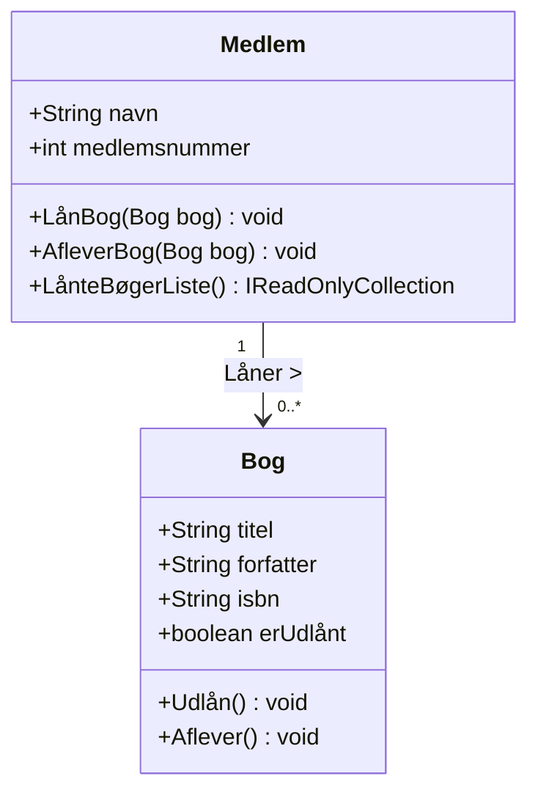
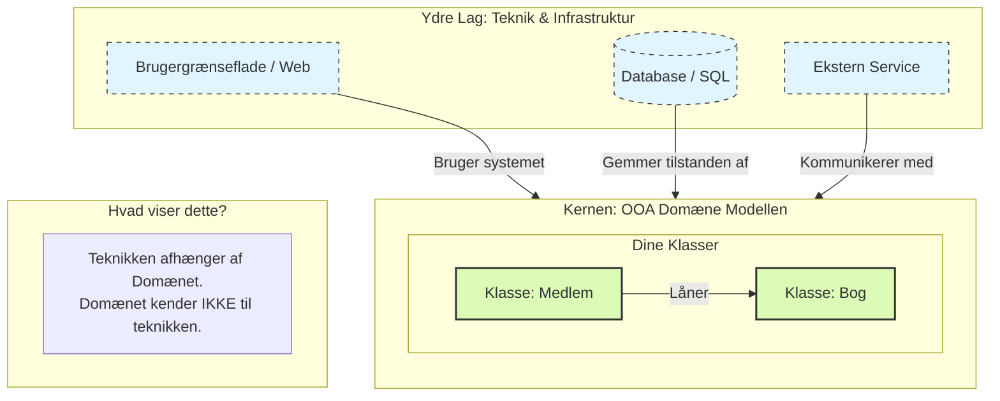

# Det Lille Bibliotek - Objekt Orienteret Analyse

**Formål:** At lære at identificere klasser, egenskaber (attributter) og adfærd (metoder) ud fra en simpel tekstbeskrivelse.


## Case

Den lokale forening har et bibliotek og har brug for et simpelt system til at holde styr på deres bøger og udlån til medlemmer.

Biblioteket har mange **bøger**. Hver bog har en titel, en forfatter og et unikt ISBN-nummer. Det er vigtigt for biblioteket altid at vide, om en bog står på hylden (er ledig), eller om den er udlånt.

Biblioteket har også **medlemmer** (lånere). Hvert medlem har et navn og et medlemsnummer. Systemet skal kunne håndtere, at et medlem **låner** en bog, hvis den er ledig. Når medlemmet er færdig med bogen, skal de kunne **aflevere** den igen, så den bliver ledig for andre.


## Opgave

Læs casen igennem og udfør en objektorienteret analyse. Du skal besvare følgende:

1. Hvilke **Domæne Objekter** (Klasser) kan du finde i teksten?
2. For hvert objekt, hvilke **Egenskaber** (data/attributter) skal det have?
3. For hvert objekt, hvilken **Adfærd** (metoder/funktioner) skal det kunne udføre?


______


# Det Lille Bibliotek - OOA - Løsningsforslag

## Løsningsforslag

#### Trin 1: Identificering af Objekter

En god tommelfingerregel for begyndere er at kigge efter navneord (substantiver) i teksten.

- *Væsentlige objekter:* **Bog**, **Medlem** (og eventuelt selve **Biblioteket** som system).

#### Trin 2: Detaljeret Analyse af Objekterne

Herunder er domænemodellen beskrevet med egenskaber og adfærd.

##### 1. Objekt: Bog (Book)

Dette objekt repræsenterer den fysiske ting på hylden.

- **Egenskaber (Hvad \*ved\* objektet?):**
  - `Titel` (Tekst): Navnet på bogen.
  - `Forfatter` (Tekst): Hvem har skrevet den.
  - `ISBN` (Tekst/Tal): Det unikke ID for bogen.
  - `ErUdlånt` (Sandt/Falsk): Status på om bogen er hjemme eller ude.
- **Adfærd (Hvad \*gør\* objektet?):**
  - `MarkérSomUdlånt()`: Ændrer status til "udlånt".
  - `MarkérSomAfleveret()`: Ændrer status til "ledig".

##### 2. Objekt: Medlem (Member)

Dette objekt repræsenterer personen, der bruger systemet.

- **Egenskaber:**
  - `Navn` (Tekst): Medlemmets fulde navn.
  - `Medlemsnummer` (Heltal): Unikt ID for medlemmet.
  - `LånteBøger` (Liste): En liste over de bøger, medlemmet har lige nu.
- **Adfærd:**
  - `LånBog(Bog)`: Modtager et bog-objekt. Hvis bogen er ledig, tilføjes den til listen, og bogen markeres som udlånt.
  - `AfleverBog(Bog)`: Fjerner bogen fra listen over lånte bøger og fortæller bogen, at den er afleveret.


#### **Klasse 1: Bog**

Dette er det mest centrale objekt i domænet.

- **Egenskaber (Attributter):**
  - `Titel` (Teksten nævner: "Hver bog har en titel")
  - `Forfatter` (Teksten nævner: "en forfatter")
  - `ISBN-nummer` (Teksten nævner: "unikt ISBN-nummer")
  - `ErUdlånt` / `Status` (Teksten nævner: "vigtigt... at vide, om en bog står på hylden") – *Dette håndteres bedst som en Ja/Nej (Boolean) værdi.*
- **Adfærd (Metoder):**
  - `ErLedig()`: En måde at spørge bogen: "Er du hjemme?"
  - `Udlån()`: Ændrer status fra ledig til udlånt.
  - `Aflever()`: Ændrer status fra udlånt til ledig.

#### **Klasse 2: Medlem (eller Låner)**

Biblioteket har brug for at vide, hvem der interagerer med bøgerne.

- **Egenskaber (Attributter):**
  - `Navn` (Teksten nævner: "Hvert medlem har et navn")
  - `Medlemsnummer` (Teksten nævner: "og et medlemsnummer")
- **Adfærd (Metoder):**
  - `LånBog(Bog)`: Handlingen hvor medlemmet tager en bog.
  - `AfleverBog(Bog)`: Handlingen hvor medlemmet returnerer en bog.
  - `LånteBøgerListe()`: Handlingen hvor medlemmet returnerer en bog.


### Klasse diagram




## Forslag til gruppe proces

### Brainstorm på tavle:

1. Tegn en kasse for **Bog**.
2. Spørg: "Hvad står der på ryggen af en bog?" -> Det bliver til egenskaberne (Titel, Forfatter).
3. Spørg: "Hvad kan man gøre med en bog?" -> Det bliver til adfærden (Låne, Aflevere).
4. Gentag for **Medlem**.


___


# Det Lille Bibliotek - Objekt Orienteret Design

Som design filosofi skal du anvende Domain-centric tilgangen. Her følger en forklaring på hvorfor og hvad Domain-centric tilgangen er.

## Domain-centric tilgangen

### Hvorfor

Domain-centric tilgang er guld værd i objektorienteret design (OOD), fordi den vender din tankegang på hovedet: I stedet for at tænke på koder og knapper, fokuserer du på **logikken i den virkelige verden**.

Her er de fire vigtigste grunde til, at det er en god tilgang:

#### 1. Robusthed over for tekniske ændringer

I en domain-centric arkitektur er din forretningslogik (f.eks. reglerne for at låne en bog) isoleret fra teknologien.

- **Fordel:** Hvis biblioteket beslutter at skifte deres SQL-database ud med en Cloud-løsning, eller hvis de vil have en mobil-app i stedet for en hjemmeside, skal du **ikke** ændre i din `Bog`- eller `Medlem`-klasse. Kernen forbliver den samme.

#### 2. "Ubiquitous Language" (Fælles sprog)

Når din model er centreret omkring domænet, bruger programmørerne og bibliotekarerne de samme ord.

- **Fordel:** Der opstår færre misforståelser. Når bibliotekaren siger "En bog skal markeres som tabt", ved programmøren præcis, at der skal tilføjes en metode til `Bog`-klassen, fremfor at lede i en kompleks database-struktur.

#### 3. Høj Testbarhed

Fordi domæne-objekterne (dine OOA-klasser) ikke er afhængige af databaser eller brugergrænseflader, er de ekstremt nemme at teste.

- **Fordel:** Du kan skrive en test, der tjekker om `lånBog()` virker, uden at du overhovedet behøver at have en computer kørende med internet eller databaser. Det gør koden meget mere fejlfri.

#### 4. Logikken samles ét sted (Cohesion)

Uden en domain-centric tilgang ender logikken ofte med at være spredt ud over det hele: lidt i databasen, lidt i brugerfladen og lidt i koden.

- **Fordel:** Ved at lægge logikken i domæne-objekterne sikrer du, at reglerne kun bor ét sted. Hvis reglen for udlån ændrer sig, skal du kun rette det i `Bog`-klassen.


### Opsummering:

Man vælger domain-centric, fordi det gør systemet **fleksibelt**, **overskueligt** og **nemt at vedligeholde**. Det sikrer, at softwaren rent faktisk løser det problem, brugeren har, fremfor at blive et rod af tekniske løsninger.


## Hvad er Domain-Centric udvikling?

At være "Domain-Centric" betyder helt enkelt, at vi designer softwaren **indefra og ud**.

I stedet for at starte med at tænke på databasetabeller (Data-Centric) eller brugergrænsefladen, starter vi med **forretningslogikken** – altså det "domæne", vi arbejder indenfor.

- **Filosofien:** Softwarens hjerte er dine domæne-regler (f.eks. "En bog kan ikke udlånes, hvis den allerede er udlånt").
- **Teknologien:** Alt andet (databaser, web-interface, apps, frameworks) betragtes som "detaljer" eller værktøjer, der blot skal understøtte domænet.


## Hvordan kobler det til OOA Domain Modellen?

Din OOA-analyse er selve fundamentet for en Domain-Centric arkitektur.

Når du laver din OOA (som i biblioteks-casen), identificerer du klasser som `Bog`, `Låner` og `Udlån` samt deres regler. I en Domain-Centric arkitektur tager du disse klasser og placerer dem i **centrum** af din applikation.

**Koblingen kan beskrives med disse 3 punkter:**

1. **OOA bliver til "Kernen":** De objekter, du fandt i din analyse (Bog, Låner), bliver til selve koden i midten af systemet (ofte kaldet *Domain Layer* eller *Entities*).
2. **Uafhængighed:** I OOA-analysen snakkede vi ikke om SQL-databaser eller HTML-knapper. Det samme gælder i koden: Dine domæne-objekter må ikke indeholde kode, der har med databaser eller UI at gøre. En `Bog`-klasse skal være "ren" C#/Java/Python logik.
3. **Beskyttelse af logik:** OOA-modellen definerer "sandheden". Domain-Centric arkitektur (som f.eks. *Onion Architecture* eller *Clean Architecture*) bygger en mur omkring din model, så tekniske ændringer (f.eks. skift af database) ikke ødelægger dine forretningsregler.

## Kort eksempel (Biblioteket)

- **OOA Analyse:** Vi bestemmer, at en `Bog` har en `titel` og en metode `markerSomUdlånt()`.
- **Domain-Centric Kode:** Vi skriver `Bog` klassen præcis sådan i koden. Den indeholder **ikke** kode til at gemme i databasen (`SaveToDb()`). At gemme bogen er en opgave for et lag *udenpå* domænet.

**Sammenfatning:** OOA-analysen er tegningen af systemets hjerte. Domain-Centric arkitektur er måden, vi bygger systemet på, så hjertet forbliver det vigtigste og mest beskyttede sted.

### Illustration




### Forklaring til tegningen:

1. **Den grønne kerne (Dine OOA-objekter):** 
   - Her bor de klasser, du fandt i din OOA-analyse (`Bog`, `Medlem`).
   - Bemærk, at pilene inde fra det gule område *ikke* peger udad. Domæne-objekterne ved intet om databaser eller websider. De er **rene**. Der står intet i koden for `Bog` om HTML, SQL eller farven på en knap. Her ligger kun logikken: *"Hvis bogen er udlånt, kan den ikke lånes igen"*.

2. **Det blå lag (Teknikken):** Her bor databasen og hjemmesiden.
   - Databasen skal vide, hvordan en `Bog` og et `Medlem` ser ud for at kunne gemme  og indlæse dem.
   - Hjemmesiden skal vide, hvordan en `Bog` og et `Medlem` ser ud for at kunne vise titlen på skærmen.
3. **Pilene (Afhængigheder):** Læg mærke til, at pilene peger **indad**. Det ydre lag kender til kernen, men kernen aner ikke, at det ydre lag eksisterer.

Det er essensen af **Domain Centric**: Hvis du skifter databasen ud eller bygger en ny app, skal du ikke ændre i din kerne (OOA-modellen), for den er uafhængig af teknikken.


### Kort sagt:

> [!IMPORTANT]
>
>  Tegningen viser, at **man bygger systemet *omkring* din OOA-analyse, i stedet for at bygge det ovenpå en database.**


-------


# OOP Domain laget

Når vi går fra en **OOA Domæne Model** (vores teoretiske analyse) til **DDD (Domain-Driven Design)** som er en konkret **Domain-Centric** tilgang til implementering i C#, transformeres vores klasser til det, vi kalder **Entities**.

En **Entity** i DDD er kendetegnet ved, at den har en unik **Identitet**, som følger den over tid, uanset om dens egenskaber ændrer sig.

Her er de vigtigste skridt i transformationen:

### 1. Fra Attribut til Identitet

I din OOA-analyse har en bog et `ISBN`. I DDD gør vi dette til den unikke nøgle. Selvom bogen får et nyt cover eller skifter titel (teoretisk set), er det stadig den samme "enhed" (Entity) i systemet på grund af dens ID.

### 2. Indkapsling (Encapsulation)

I DDD må man ikke bare ændre data udefra (ingen "public setters" på alt). Vi gør egenskaberne `private set`, så vi tvinger koden til at bruge vores metoder. Det sikrer, at domænereglerne overholdes.

### 3. Logikken ind i klassen

I stedet for bare at gemme data, skal klassen styre sin egen tilstand. Metoden `LånBog()` skal tjekke, om bogen allerede er udlånt, før den ændrer status.

------

### Eksempel i C#

Her er hvordan din `Bog` og `Medlem` ser ud som DDD Entities kodet i C#:

```c#
public class Entity
{
    // Identitet - vigtig i DDD
    public int Id { get; protected set; }
}

// Domæne Entity: Bog
public class Bog : Entity
{
    public string Isbn { get; private set; }
    public string Titel { get; private set; }
    public string Forfatter { get; private set; }
    public bool ErUdlånt { get; private set; }

    public Bog(string isbn, string titel, string forfatter, bool erUdlånt=false)
    {
        if (string.IsNullOrWhiteSpace(isbn)) throw new ArgumentException("ISBN mangler");
        
        Isbn = isbn;
        Titel = titel;
        Forfatter = forfatter;
        ErUdlånt = erUdlånt;
    }

    // Domæne-logik (Adfærd)
    public void Udlån()
    {
        if (ErUdlånt)
            throw new InvalidOperationException("Bogen er allerede udlånt.");

        ErUdlånt = true;
    }

    public void Aflever()
    {
        ErUdlånt = false;
    }
}

// Domæne Entity: Medlem
public class Medlem : Entity
{
    public int MedlemsNummer { get; private set; }
    public string Navn { get; private set; }
    private List<Bog> LånteBøger{ get; set;}
    public Medlem(int nummer, string navn)
    {
        MedlemsNummer = nummer;
        Navn = navn;
    }

  
    public void LånBog(Bog bog)
    {
        // Her udføres forretningsreglen
        bog.Udlån();

        LånteBøger ??= [];

        LånteBøger.Add(bog);

        // Her kunne man også tilføje bogen til en liste over medlemmets lån
        Console.WriteLine($"{Navn} har nu lånt '{bog.Titel}'");
    }

    public void AfleverBog(Bog bog)
    {
        // Her udføres forretningsreglen
        if(!LånteBøger.Contains(bog))
            throw new InvalidOperationException("Medlem har IKKE lånt bogen.");

        bog.Aflever();

        LånteBøger.Remove(bog);

        // Her kunne man også tilføje bogen til en liste over medlemmets lån
        Console.WriteLine($"{Navn} har nu afleveret '{bog.Titel}'");
    }

    public IReadOnlyCollection<Bog> LånteBøgerListe()
    {
        return LånteBøger;
    }
}
```

------

### Sammenkoblingen til DDD-begreber

I dette eksempel ser du tre kerne-elementer af DDD:

1. **Gward Clauses:** I constructoren og metoderne tjekker vi `if (ErUdlånt)`. Dette sikrer, at objektet aldrig kommer i en ugyldig tilstand. Det er "Domain Centric" logik.
2. **Rich Domain Model:** Vores klasser er ikke bare tomme beholdere (Anemic Domain Model), men har faktisk logik og beskytter deres egne data.
3. **Identitet:** `Isbn` og `MedlemsNummer` bruges til at skelne mellem objekter, selvom to personer hedder "Lars" eller to bøger har samme titel.

**Hvad betyder det for din kode?**

Det betyder, at hvis en programmør prøver at udlåne en bog, der allerede er væk, så "skælder koden ud" (kaster en Exception). Logikken bor i **hjertet** af systemet, præcis som vi tegnede i løg-arkitekturen.


-----


## Domain-Centric og DDD - Fra UI til Entity metode kald

> [!IMPORTANT]
>
> Hvordan hændelser fra brugeren (aktør) bliver til aktivering af adfærd


Det er et meget vigtigt spørgsmål. For begyndere er det tit det sværeste "missing link": Hvordan kommer vi fra et klik på en skærm til at koden inde i `Medlem`-klassen kører?

I moderne softwarearkitektur (og især i DDD) taler vi aldrig direkte med domæne-objekterne fra brugergrænsefladen. Vi har brug for et **mellemlag** – en "koordinator" eller "orkestrator".

I DDD kaldes dette ofte en **Application Service** (eller Use Case).

Her er forklaringen på flowet fra bruger til kode, efterfulgt af et C# eksempel.

### Flowet: De 5 Trin

Forestil dig, at bibliotekaren sidder ved en skærm og trykker på knappen **"Opret Lån"**.

Hændelsen rejser gennem systemet sådan her:

1. **Aktøren (Brugeren)** indtaster data (f.eks. medlems-ID og bog-ID) og klikker "Lån".
2. **API / UI Laget** modtager klikket og sender en besked til applikationen: "Jeg vil gerne udføre kommandoen `LånBog`".
3. **Application Service (Koordinatoren)** tager imod beskeden. Dens job er at hente de rigtige objekter frem fra databasen.
4. **Domæne Logik (Adfærd)** aktiveres. Koordinatoren beder `Medlem`-objektet om at udføre `LånBog()`. Det er her, reglerne tjekkes.
5. **Persistering (Gem)**. Hvis alt gik godt, gemmer koordinatoren de ændrede objekter tilbage i databasen.

------

### C# Eksempel: "UdlånUseCase"

Her laver vi den klasse, der binder det hele sammen. Vi lader som om, vi har et "Repository" (en klasse der henter data fra databasen), da det er standardmåden at finde entities på.

```csharp
// Dette er "Application Layer" - Koordinatoren
public class UdlånUseCase
{
    private readonly IBogRepository _bogRepository;
    private readonly IMedlemsRepository _medlemsRepository;

    // Vi får adgang til databasen (Repository) gennem konstruktøren
    public UdlånUseCase(IBogRepository bogRepo, IMedlemsRepository medlRepo)
    {
        _bogRepository = bogRepo;
        _medlemsRepository = medlRepo;
    }

    // Dette er metoden, der bliver kaldt, når brugeren trykker på knappen
    public void LånAfBog(int medlemsId, int bogId)
    {
        // TRIN 1: Hent data (Rehydrering af objekter)
        // Vi henter domæne-objekterne op fra databasen baseret på ID.
        var medlem = _medlemsRepository.HentPåId(medlemsId);
        var bog = _bogRepository.HentPåId(bogId);

        // Validering: Findes de overhovedet?
        if (medlem == null) throw new Exception("Medlem ikke fundet");
        if (bog == null) throw new Exception("Bog ikke fundet");

        // TRIN 2: Aktiver Adfærd (Her sker magien)
        // Vi kalder metoden på vores DDD Entity.
        // Bemærk: Servicen kender ikke reglerne (f.eks. "maks 3 bøger"). 
        // Den beder bare medlemmet om at gøre det.
        try 
        {
            medlem.LånBog(bog); 
        }
        catch (InvalidOperationException ex)
        {
            // Hvis reglen blev brudt (f.eks. bogen er allerede udlånt),
            // sender vi fejlen tilbage til brugeren her.
            Console.WriteLine($"Fejl: {ex.Message}");
            return; 
        }

        // TRIN 3: Gem ændringer (Persistering)
        // Nu har objekterne ændret sig (bogen er 'udlånt', medlemmet har et ID i sin liste).
        // Vi skal gemme den nye tilstand i databasen.
        _bogRepository.Gem(bog);
        _medlemsRepository.Gem(medlem);
        
        Console.WriteLine("Bogen er nu udlånt!");
    }
}
```


### Hvorfor gør vi det sådan?

Hvis de spørger, hvorfor man ikke bare retter direkte i databasen fra knappen, er svaret:

- **Sikkerhed:** Hvis vi glemmer at bruge `medlem.LånBog()`, glemmer vi måske at tjekke, om bogen allerede er udlånt. Ved at tvinge alt gennem `BiblioteksService` -> `Entity`, sikrer vi, at reglerne *altid* overholdes.
- **Testbarhed:** Vi kan nemt teste `Medlem`-klassen uden at skulle have en hel database kørende.

Giver denne opdeling mening i forhold til den opgave, du er ved at bygge?