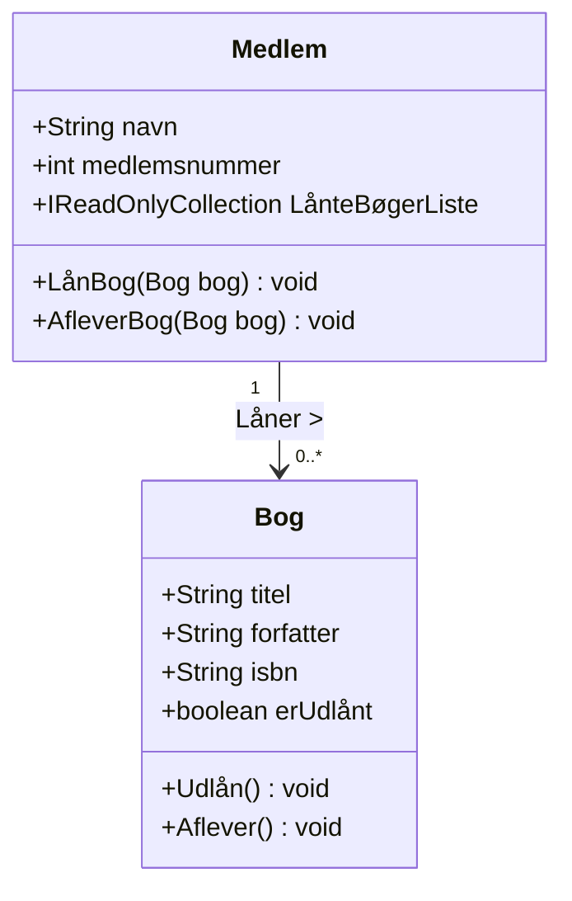

# Det Lille Bibliotek - OOA - Løsningsforslag

## Løsningsforslag

#### Trin 1: Identificering af Objekter

En god tommelfingerregel for begyndere er at kigge efter navneord (substantiver) i teksten.

- *Væsentlige objekter:* **Bog**, **Medlem** (og eventuelt selve **Biblioteket** som system).

#### Trin 2: Detaljeret Analyse af Objekterne

Herunder er domænemodellen beskrevet med egenskaber og adfærd.

##### 1. Objekt: Bog (Book)

Dette objekt repræsenterer den fysiske ting på hylden.

- **Egenskaber (Hvad \*ved\* objektet?):**
  - `Titel` (Tekst): Navnet på bogen.
  - `Forfatter` (Tekst): Hvem har skrevet den.
  - `ISBN` (Tekst/Tal): Det unikke ID for bogen.
  - `ErUdlånt` (Sandt/Falsk): Status på om bogen er hjemme eller ude.
- **Adfærd (Hvad \*gør\* objektet?):**
  - `MarkérSomUdlånt()`: Ændrer status til "udlånt".
  - `MarkérSomAfleveret()`: Ændrer status til "ledig".

##### 2. Objekt: Medlem (Member)

Dette objekt repræsenterer personen, der bruger systemet.

- **Egenskaber:**
  - `Navn` (Tekst): Medlemmets fulde navn.
  - `Medlemsnummer` (Heltal): Unikt ID for medlemmet.
  - `LånteBøger` (Liste): En liste over de bøger, medlemmet har lige nu.
- **Adfærd:**
  - `LånBog(Bog)`: Modtager et bog-objekt. Hvis bogen er ledig, tilføjes den til listen, og bogen markeres som udlånt.
  - `AfleverBog(Bog)`: Fjerner bogen fra listen over lånte bøger og fortæller bogen, at den er afleveret.

#### **Klasse 1: Bog**

Dette er det mest centrale objekt i domænet.

- **Egenskaber (Attributter):**
  - `Titel` (Teksten nævner: "Hver bog har en titel")
  - `Forfatter` (Teksten nævner: "en forfatter")
  - `ISBN-nummer` (Teksten nævner: "unikt ISBN-nummer")
  - `ErUdlånt` / `Status` (Teksten nævner: "vigtigt... at vide, om en bog står på hylden") – *Dette håndteres bedst som en Ja/Nej (Boolean) værdi.*
- **Adfærd (Metoder):**
  - `ErLedig()`: En måde at spørge bogen: "Er du hjemme?"
  - `Udlån()`: Ændrer status fra ledig til udlånt.
  - `Aflever()`: Ændrer status fra udlånt til ledig.

#### **Klasse 2: Medlem (eller Låner)**

Biblioteket har brug for at vide, hvem der interagerer med bøgerne.

- **Egenskaber (Attributter):**
  - `Navn` (Teksten nævner: "Hvert medlem har et navn")
  - `Medlemsnummer` (Teksten nævner: "og et medlemsnummer")
  - `AktuelleLånteBøger`: List af de bøger medlemmet har lånt i øjeblikket.
- **Adfærd (Metoder):**
  - `LånBog(Bog)`: Handlingen hvor medlemmet tager en bog.
  - `AfleverBog(Bog)`: Handlingen hvor medlemmet returnerer en bog.

### Klasse diagram

## Forslag til gruppe proces

### Brainstorm på tavle:

1. Tegn en kasse for **Bog**.
2. Spørg: "Hvad står der på ryggen af en bog?" -> Det bliver til egenskaberne (Titel, Forfatter).
3. Spørg: "Hvad kan man gøre med en bog?" -> Det bliver til adfærden (Låne, Aflevere).
4. Gentag for **Medlem**.

