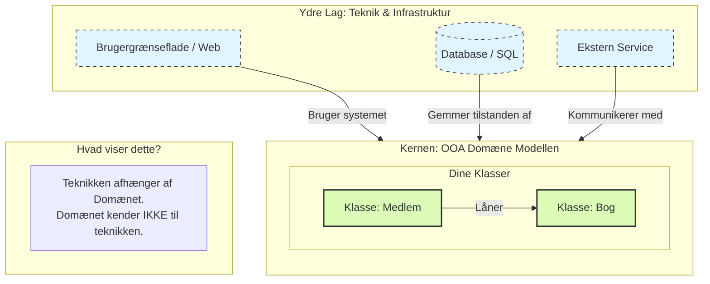

# Det Lille Bibliotek - Objekt Orienteret Design

Som design filosofi skal du anvende Domain-centric tilgangen. Her følger en forklaring på hvorfor og hvad Domain-centric tilgangen er.

## Domain-centric tilgangen

### Hvorfor

Domain-centric tilgang er guld værd i objektorienteret design (OOD), fordi den vender din tankegang på hovedet: I stedet for at tænke på koder og knapper, fokuserer du på **logikken i den virkelige verden**.

Her er de fire vigtigste grunde til, at det er en god tilgang:

#### 1. Robusthed over for tekniske ændringer

I en domain-centric arkitektur er din forretningslogik (f.eks. reglerne for at låne en bog) isoleret fra teknologien.

- **Fordel:** Hvis biblioteket beslutter at skifte deres SQL-database ud med en Cloud-løsning, eller hvis de vil have en mobil-app i stedet for en hjemmeside, skal du **ikke** ændre i din `Bog`- eller `Medlem`-klasse. Kernen forbliver den samme.

#### 2. "Ubiquitous Language" (Fælles sprog)

Når din model er centreret omkring domænet, bruger programmørerne og bibliotekarerne de samme ord.

- **Fordel:** Der opstår færre misforståelser. Når bibliotekaren siger "En bog skal markeres som tabt", ved programmøren præcis, at der skal tilføjes en metode til `Bog`-klassen, fremfor at lede i en kompleks database-struktur.

#### 3. Høj Testbarhed

Fordi domæne-objekterne (dine OOA-klasser) ikke er afhængige af databaser eller brugergrænseflader, er de ekstremt nemme at teste.

- **Fordel:** Du kan skrive en test, der tjekker om `LånBog()` virker, uden at du overhovedet behøver at have en computer kørende med internet eller databaser. Det gør koden meget mere fejlfri.

#### 4. Logikken samles ét sted (Cohesion)

Uden en domain-centric tilgang ender logikken ofte med at være spredt ud over det hele: lidt i databasen, lidt i brugerfladen og lidt i koden.

- **Fordel:** Ved at lægge logikken i domæne-objekterne sikrer du, at reglerne kun bor ét sted. Hvis reglen for udlån ændrer sig, skal du kun rette det i `Bog`-klassen.

### Opsummering:
Man vælger domain-centric, fordi det gør systemet **fleksibelt**, **overskueligt** og **nemt at vedligeholde**. Det sikrer, at softwaren rent faktisk løser det problem, brugeren har, fremfor at blive et rod af tekniske løsninger.

## Hvad er Domain-Centric udvikling?

At være "Domain-Centric" betyder helt enkelt, at vi designer softwaren **indefra og ud**.

I stedet for at starte med at tænke på databasetabeller (Data-Centric) eller brugergrænsefladen, starter vi med **forretningslogikken** – altså det "domæne", vi arbejder indenfor.

- **Filosofien:** Softwarens hjerte er dine domæne-regler (f.eks. "En bog kan ikke udlånes, hvis den allerede er udlånt").
- **Teknologien:** Alt andet (databaser, web-interface, apps, frameworks) betragtes som "detaljer" eller værktøjer, der blot skal understøtte domænet.

## Hvordan kobler det til OOA Domain Modellen?

Din OOA-analyse er selve fundamentet for en Domain-Centric arkitektur.

Når du laver din OOA (som i biblioteks-casen), identificerer du klasser som `Bog`, `Medlem`  samt deres regler. I en Domain-Centric arkitektur tager du disse klasser og placerer dem i **centrum** af din applikation.

**Koblingen kan beskrives med disse 3 punkter:**

1. **OOA bliver til "Kernen":** De objekter, du fandt i din analyse (Bog, Låner), bliver til selve koden i midten af systemet (ofte kaldet *Domain Layer* eller *Entities*).
2. **Uafhængighed:** I OOA-analysen snakkede vi ikke om SQL-databaser eller HTML-knapper. Det samme gælder i koden: Dine domæne-objekter må ikke indeholde kode, der har med databaser eller UI at gøre. En `Bog`-klasse skal være "ren" C#/Java/Python logik.
3. **Beskyttelse af logik:** OOA-modellen definerer "sandheden". Domain-Centric arkitektur (som f.eks. *Onion Architecture* eller *Clean Architecture*) bygger en mur omkring din model, så tekniske ændringer (f.eks. skift af database) ikke ødelægger dine forretningsregler.

## Kort eksempel (Biblioteket)

- **OOA Analyse:** Vi bestemmer, at en `Bog` har en `Titel` og en metode `Udlån()`.
- **Domain-Centric Kode:** Vi skriver `Bog` klassen præcis sådan i koden. Den indeholder **ikke** kode til at gemme i databasen (`SaveToDb()`). At gemme bogen er en opgave for et lag *udenpå* domænet.

**Sammenfatning:** OOA-analysen er tegningen af systemets hjerte. Domain-Centric arkitektur er måden, vi bygger systemet på, så hjertet forbliver det vigtigste og mest beskyttede sted.

### Illustration

### Forklaring til tegningen:

1. **Den grønne kerne (Dine OOA-objekter):** 
	- Her bor de klasser, du fandt i din OOA-analyse (`Bog`, `Medlem`).
	- Bemærk, at pilene inde fra det gule område *ikke* peger udad. Domæne-objekterne ved intet om databaser eller websider. De er **rene**. Der står intet i koden for `Bog` om HTML, SQL eller farven på en knap. Her ligger kun logikken: *"Hvis bogen er udlånt, kan den ikke lånes igen"*.
   
3. **Det blå lag (Teknikken):** Her bor databasen og hjemmesiden.
   - Databasen skal vide, hvordan en `Bog` og et `Medlem` ser ud for at kunne gemme  og indlæse dem.
   - Hjemmesiden skal vide, hvordan en `Bog` og et `Medlem` ser ud for at kunne vise titlen på skærmen.
4. **Pilene (Afhængigheder):** Læg mærke til, at pilene peger **indad**. Det ydre lag kender til kernen, men kernen aner ikke, at det ydre lag eksisterer.

Det er essensen af **Domain Centric**: Hvis du skifter databasen ud eller bygger en ny app, skal du ikke ændre i din kerne (OOA-modellen), for den er uafhængig af teknikken.

### Kort sagt:

> [!IMPORTANT]
>
>  Tegningen viser, at **man bygger systemet *omkring* din OOA-analyse, i stedet for at bygge det ovenpå en database.**